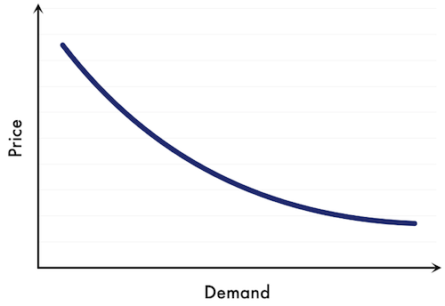

```{r knitr_init, echo = FALSE, results = "asis", cache = FALSE}
library(knitr)
library(rmdformats)
library(kableExtra)

res        <- read.csv(file = "2_output/1_data/res.csv")
allModsRes <- read.csv(file = "2_output/1_data/allMods.csv")

## Global options
options(max.print = "75")
opts_chunk$set(echo    = TRUE,
               cache   = FALSE,
               prompt  = FALSE,
               tidy    = FALSE,
               comment = NA,
               message = FALSE,
               warning = FALSE)
opts_knit$set(width = 75)
```

# Introduction {.tabset .tabset-fade}

For this project we are given a number of datasets; **sales**, **crm**, **finance** and **twitter** data. From these datasets, we will need to analyse the data and build a model that can accurately predict which customers are most likely to churn. We perform this modelling and prediction excersice since if we know in advance which customers are more likely to leave us, we can perform actions in order to prevent them from leaving us in a cost-efficient way.

The project is structured as follows :

1. Analyse and extract features from the twitter data
2. Combine all the data sources together in a single dataset
3. Perform and Exploratory Data Analysis
4. Build various models and inspect these to find the winning solution

Once these steps are complete we provide business case strategies and an overall conclusion, based on the data provided.

One of the challenges for our team was that we were skilled in both **R** and **Python**. To overcome this obstacle, we used **RStudio** and specifically a package called `reticulate` from **R** which allows us to run **Python** code directly from within **R**. This allowed the team to easily collaborate and learn from each other.

Speaking of the team, this is who we are :

```{r fig.show = "hold", out.width = "100%", fig.align = "center", echo = FALSE}

```

**PLEASE NOTE** you can click on the little **CODE** button (at the top right of the report) and then click on **Show All** to display the code that results in the output. We also found that the report might be slow to load on some pages, please be patient and give it a few seconds to load as the report is quite large.

```{r fig.show = "hold", out.width = "50%", fig.align = "center", echo = FALSE}

```

# Setup and Loading Data {.tabset .tabset-fade}

In this section we will load all the libraries needed to perform our analysis as well as the raw data we received.

```{r}
options(scipen = 999)
library(lubridate)
library(dplyr)
library(readr)
library(plotly)
library(cluster)
library(factoextra)
library(FactoMineR)
library(missMDA)
library(caret)
library(openxlsx)
library(GGally)
library(naniar)
library(MLmetrics)
library(gbm)
library(rsample)
library(recipes)
library(h2o)
library(gridExtra)

day.abb <- c("Mon", "Tue", "Wed", "Thu", "Fri", "Sat", "Sun")

crmDat   <- readr::read_csv("0_data/crm_model.csv",     col_types = cols(.default = "c"))
finDat   <- readr::read_csv("0_data/finance_model.csv", col_types = cols(.default = "c"))
salesDat <- readr::read_csv("0_data/sales_model.csv",   col_types = cols(.default = "c"))
twiter   <- readr::read_csv("0_data/twitter_model.csv", col_types = cols(.default = "c"))

# Upload the winning model and prediction threshold
h2o::h2o.init(nthreads = 8, enable_assertions = FALSE)
finMod    <- h2o::h2o.upload_model(path = list.files(path = "2_output/3_model/bin/", full.names = TRUE))
finThresh <- finMod@model$default_threshold
```
<br>

Here are the custom functions we define for the project.

## propFunc

This function describes the dataset by looking at the top `n` variables based on the proportion of each level present ranked from most common to least.

```{r}
propFunc <- function(datIn, vars, totToReturn, asDF = TRUE) {
    outpList <- list()
    for (vr in vars) {
        varSelected <- datIn[[vr]]
        varSelected[grepl(x = varSelected, pattern = "NA", 
            ignore.case = TRUE)] <- NA
        outp <- as.data.frame(prop.table(table(varSelected, useNA = "always")))
        NAValue <- outp$Freq[is.na(outp$varSelected)]
        outp <- outp[!is.na(outp$varSelected), ]
        outp <- outp[order(-outp$Freq), ]
        FinalOutp <- data.frame(varSelected = "NA", Freq = NAValue)
        ender <- min((totToReturn - 1), nrow(outp))
        toDrop <- nrow(outp) - ender
        toDropData <- data.frame(varSelected = c("Rest", 
            "RestCount"), Freq = c(ifelse(nrow(outp) == 
            0, 0, toDrop/nrow(outp)), toDrop))
        if (nrow(outp) > 0) {
            FinalOutp <- rbind(FinalOutp, outp[1:ender, ], toDropData)
        }
        else {
            FinalOutp <- rbind(FinalOutp, toDropData)
        }
        FinalOutp$Freq <- round(FinalOutp$Freq, 4)
        tempList <- list(FinalOutp$Freq)
        names(tempList) <- vr
        names(tempList[[1]]) <- FinalOutp$varSelected
        outpList <- append(outpList, tempList)
    }
    if (asDF) {
        for (ii in 1:length(outpList)) {
            rowVals <- outpList[ii]
            rowValsNames <- names(rowVals[[1]])
            tempDf <- as.data.frame(rowVals)
            rownames(tempDf) <- rowValsNames
            tempDf <- t(tempDf)
            RestRestCount <- t(as.data.frame(tempDf[, c(c("Rest", 
                "RestCount"))]))
            rownames(RestRestCount) <- "1"
            otherDat <- tempDf[, !(colnames(tempDf) %in% c("Rest", 
                "RestCount"))]
            finDat <- t(data.frame(paste0(names(otherDat), " : ", 
                otherDat)))
            rownames(finDat) <- "1"
            colnames(finDat) <- paste0("Var_", seq(1:dim(finDat)[2]))
            finDat <- cbind(finDat, RestRestCount)
            finDat <- as.data.frame(finDat)
            if (ii == 1) {
                combinedFinDat <- finDat
            }
            else {
                combinedFinDat <- dplyr::bind_rows(combinedFinDat, 
                  finDat)
            }
        }
        rownames(combinedFinDat) <- names(outpList)
        outpList <- combinedFinDat
        outpList <- dplyr::select(outpList, -c(Rest, RestCount), 
            everything())
    }
    return(outpList)
}
```

As an example we can look at the classic mtcars

```{r}
propFunc(datIn = mtcars, vars = names(mtcars), totToReturn = 3, asDF = TRUE) %>% 
  kableExtra::kable(format = "html") %>% kableExtra::kable_styling("striped") %>% kableExtra::scroll_box(width = "100%")
```

The first variable always shows the missing values in per variable (as shown per row). Then the second variable and from there on shows the levels as well as their proportions ranked from most frequent to least, hence for the variable (row) `cyl` we see that having $8$ cylinders is most common and it represents $43.75\%$ of all observations. Since we asked for only 3 variables to be returned (including NA, hence only 2) we see in the column `RestCount` that there is $1$ other level not shown. The column `Rest` is the proportion of other variables not shown, hence as we know there are a total of $3$ levels for the variable `cyl` and $1$ of them isn't shown, hence $33.3\%$ of the levels are not shown.

This function allows us to very quickly get a deep insight in our data by identifying 2 main concerns :

- How complete each variable is
- Do we have variables with near zero variance

## plotFreq

This function is quite complex and rich in features. It allows us to plot any variable by it's levels showing the exposure of each level it will show the average of the specified `target`, in this case it is the retention rate. Finally it will show a horizontal line showing the overall portfolio average. We can also plot the predicted values if available.

There are a number of additional parameters that will control the plots, such as whether the variable we are inspecting is numeric or not, if it is numeric we can specify the breaks as well which will result in a similar plot as a categorical variable. Finally we can `autoBin` the variables based on exposure and/or the variance of the target between the levels.

```{r}
plotTarget <- function(datIn, var_inspect, var_expo = NULL, target, numvar = TRUE, numVarBreaks = NULL, autoBin = TRUE, varStrength = 2, expoThreshold = 0.02, predVar = NULL, countVar = NULL) {
  
  if (is.null(var_expo)) {
    datIn$exposureVar <- 1
    var_expo <- "exposureVar"
  }
  
  datIn[[target]] <- as.numeric(as.character(datIn[[target]]))
  
  if (numvar) {
    if (!is.null(numVarBreaks)) {
      datIn[[var_inspect]] <- cut(datIn[[var_inspect]], breaks = numVarBreaks) %>% as.character()
    } else {
      datIn[[var_inspect]] <- cut(datIn[[var_inspect]], breaks = 10) %>% as.character()
    }
  } 
  
  if (is.null(countVar)) {
    
    if (is.null(predVar)) {
      stat_summary <- datIn %>% 
      group_by(!!sym(var_inspect)) %>%
      summarise(expo       = sum(!!sym(var_expo), na.rm = TRUE),
                totTarget  = sum(!!sym(target), na.rm = T),
                prop       = sum(!!sym(target), na.rm = T) / expo)
    } else {
      stat_summary <- datIn %>% 
      group_by(!!sym(var_inspect)) %>%
      summarise(expo       = sum(!!sym(var_expo), na.rm = TRUE),
                totTarget  = sum(!!sym(target),   na.rm = T),
                predClaims = sum(!!sym(predVar),  na.rm = T),
                prop       = sum(!!sym(target),   na.rm = T) / expo,
                predprop   = sum(!!sym(predVar),  na.rm = T) / expo)
    }
    
  } else {
    
    if (is.null(predVar)) {
      stat_summary <- datIn %>% 
      group_by(!!sym(var_inspect)) %>%
      summarise(expo       = sum(!!sym(var_expo),       na.rm = TRUE),
                totTarget  = sum(!!sym(target), na.rm = T),
                prop       = sum(!!sym(target), na.rm = T) / sum(!!sym(countVar), na.rm = T))
    } else {
      stat_summary <- datIn %>% 
      group_by(!!sym(var_inspect)) %>%
      summarise(expo       = sum(!!sym(var_expo),       na.rm = TRUE),
                totTarget  = sum(!!sym(target), na.rm = T),
                predClaims = sum(!!sym(predVar), na.rm = T),
                prop       = sum(!!sym(target), na.rm = T) / sum(!!sym(countVar), na.rm = T),
                predprop   = sum(!!sym(predVar), na.rm = T) / sum(!!sym(countVar), na.rm = T))
    }
    
  }
  
  n <- sum(datIn[[var_expo]], na.rm = TRUE)
  
  meanprop <- sum(datIn[[target]], na.rm = TRUE) / n
  varprop  <- sum((datIn[[target]] - meanprop)^2, na.rm = TRUE) / (n - 1)

  stat_summary[[var_inspect]] <- as.character(stat_summary[[var_inspect]])
  
  if (numvar) {
    ordr <- data.frame(uniqueVars = stat_summary[[var_inspect]]) %>% 
      mutate(numversion = gsub(x = uniqueVars, pattern = "\\((.*),.*]", replacement = "\\1") %>% as.numeric()) %>% 
      arrange(numversion)
    
    stat_summary[[var_inspect]][is.na(stat_summary[[var_inspect]])] <- -abs(min(ordr$uniqueVars) %>% as.character() %>% as.numeric()*1000)
    stat_summary[[var_inspect]] <- factor(stat_summary[[var_inspect]], levels = ordr$uniqueVars)
  } else {
    stat_summary[[var_inspect]][is.na(stat_summary[[var_inspect]])] <- "NA"
    stat_summary[[var_inspect]] <- factor(stat_summary[[var_inspect]], levels = unique(stat_summary[[var_inspect]]) %>% sort())
  }
  
  if (autoBin) {
    stat_summary[[var_inspect]] <- as.character(stat_summary[[var_inspect]])
    stat_summary <- stat_summary %>% 
      mutate(expoProp = expo/sum(expo, na.rm = TRUE),
             other    = dplyr::if_else((prop >= meanprop + (varprop/varStrength) | prop <= meanprop - (varprop/varStrength)) &
                                       (expoProp >= expoThreshold) , !!sym(var_inspect), "other")) %>% 
      select(-expoProp)
    stat_summary[[var_inspect]] <- stat_summary$other
    stat_summary$other <- NULL
    stat_summary <- stat_summary %>% 
      group_by(!!sym(var_inspect)) %>%
      summarise(expo      = sum(expo,      na.rm = TRUE),
                totTarget = sum(totTarget, na.rm = T),
                prop      = sum(totTarget, na.rm = T) / expo)
  }
  
  if (is.null(predVar)) {
    p <- stat_summary %>%
      plotly::plot_ly() %>% 
      plotly::add_markers(x = ~get(var_inspect), y = ~prop, name = paste0("Observed ", target), marker = list(color = 'maroon')) %>% 
      plotly::add_lines(x = stat_summary[[var_inspect]], y = rep(meanprop, nrow(stat_summary)), name = paste0("Average ", target), line = list(color = 'maroon')) %>%
      plotly::add_bars(x = ~get(var_inspect), y = ~expo, alpha = 0.7, yaxis = "y2", name = "Expo", marker = list(color = 'wheat'), opacity = 0.7) %>% 
      plotly::layout(title = paste0("Observed ", target, " by ", var_inspect),
                     xaxis  = list(title    = var_inspect,
                                   zeroline = FALSE),
                     yaxis  = list(title    = target,
                                   zeroline = FALSE, 
                                   showgrid = F),
                     yaxis2 = list(zeroline   = FALSE,
                                   showgrid   = F,
                                   overlaying = "y",
                                   side       = "right",
                                   title      = "Exposure"))
  } else {
    p <- stat_summary %>%
      plotly::plot_ly() %>% 
      plotly::add_markers(x = ~get(var_inspect), y = ~prop, name = paste0("Observed ", target), marker = list(color = 'maroon')) %>% 
      plotly::add_markers(x = ~get(var_inspect), y = ~predprop, name = paste0("Predicted ", target), marker = list(color = 'blue')) %>% 
      plotly::add_lines(x = stat_summary[[var_inspect]], y = rep(meanprop, nrow(stat_summary)), name = paste0("Average ", target), line = list(color = 'maroon')) %>%
      plotly::add_bars(x = ~get(var_inspect), y = ~expo, alpha = 0.7, yaxis = "y2", name = "Expo", marker = list(color = 'wheat'), opacity = 0.7) %>% 
      plotly::layout(title = paste0("Observed and Predicted ", target, " by ", var_inspect),
                     xaxis  = list(title    = var_inspect,
                                   zeroline = FALSE),
                     yaxis  = list(title    = target,
                                   zeroline = FALSE, 
                                   showgrid = F),
                     yaxis2 = list(zeroline   = FALSE,
                                   showgrid   = F,
                                   overlaying = "y",
                                   side       = "right",
                                   title      = "Exposure"))
  }
  names(stat_summary)[names(stat_summary) == "totTarget"] <- paste0("tot_",  target)
  names(stat_summary)[names(stat_summary) == "prop"]      <- paste0("ave_", target)
  return(list(summary = stat_summary, plt = p, nonGroupedVars = stat_summary[[var_inspect]][stat_summary[[var_inspect]] != "other"]))
}
```

Let's take a look at an example again

```{r}
plt <- plotTarget(datIn = mtcars, var_inspect = "cyl", target = "mpg", autoBin = FALSE, numvar = FALSE)
plt$plt
```

## smartGrouper

The `smartGrouper` function allows us to group levels of a single variable in a dataset to a reduced number. The function works with categorical variables only. The logic is as follows :

1. We perform one-hot-encoding on the variable
2. Perform MCA on the resulting dataframe
3. Cluster the MCA Dimensions using k-means, 
4. The optimal number of clusters is found using the silhouette method. We calculate the 95th quantile of the silhouette scores and choose the first `k` that is greater or equal to this hence resulting in the number of levels we will end with

```{r}
smartGrouper <- function(datIn, varIn, replaceVar = TRUE, newNames = FALSE, groupThresh = 0.05) {
  
  levsMax <- datIn[[varIn]] %>% unique() %>% length()

  # Need to add imputation step here!
  
  set.seed(2020)
  res <- FactoMineR::MCA(X = datIn %>% select(!!sym(varIn)) %>% mutate_all(.funs = as.character))
  
  mcaDims <- res$ind$coord %>% dplyr::as_tibble() 
  
  silhouette_score <- function(datIn, k) {
    finRes <- c()
    for (ii in k) {
      set.seed(2021)
      km <- kmeans(mcaDims, centers = ii, nstart = 25)
      ss <- silhouette(km$cluster, dist(datIn))
      res <- mean(ss[, 3])
      finRes <- c(finRes, res)
    }
    return(finRes)
  }
  
  siScores <- silhouette_score(datIn = mcaDims, k = 2:levsMax)
  cc       <- which(siScores >= quantile(siScores, 0.95))[1]
  set.seed(2022)
  km       <- kmeans(mcaDims, centers = cc, nstart = 25)
  
  if (newNames) {
    finClusts <- openxlsx::int2col(km$cluster)
  } else {
    finClusts <- data.frame(oldName = datIn[[varIn]], cluster = km$cluster, id = 1:nrow(datIn))
    replacements <- finClusts %>% select(-id) %>% distinct() %>% group_by(cluster) %>% mutate(oldName = oldName %>% unique() %>% na.omit() %>% paste(collapse = "|")) %>% distinct(cluster, .keep_all = TRUE)
    names(replacements) <- c(varIn, "cluster")
    finClusts <- finClusts %>% select(-oldName) %>% left_join(replacements) %>% select(-cluster) %>% arrange(id) %>% select(-id)
    finClusts <- finClusts[[1]]
  }
  
  if (replaceVar) {
    datIn[[varIn]] <- finClusts
  } else {
    varIn <- paste0(varIn, "_", "bis")
    datIn[[varIn]] <- finClusts
  }
  
  levs  <- datIn[[varIn]] %>% table() 
  other <- names(levs)[levs < round(datIn %>% nrow() * groupThresh, 0)]
  datIn[[varIn]][datIn[[varIn]] %in% other] <- "other"
  
  return(datIn)
}
```

Let's take a look at an example, using the mtcars, but in this case we need to use a continuous variable (transforming it to categorical) :

```{r echo = FALSE}
result <- smartGrouper(datIn = mtcars %>% mutate(disp = as.character(disp)), varIn = "disp")
result %>% kableExtra::kable(format = "html") %>% kableExtra::kable_styling("striped") %>% kableExtra::scroll_box(width = "100%") 
```

There are two options for the function that will allow you to either overwrite the variable of interest or create a new one.

```{r}
rm(result)
```

## getSeason

This function allows us to get the season from a date. 2012 is a good year to which to convert all of the dates; since it is a leap year, any February 29ths in your data set will be handled smoothly.

```{r}
getSeason <- function(dateIn) {
    WS <- as.Date("2012-12-15", format = "%Y-%m-%d") # Winter Solstice
    SE <- as.Date("2012-3-15",  format = "%Y-%m-%d") # Spring Equinox
    SS <- as.Date("2012-6-15",  format = "%Y-%m-%d") # Summer Solstice
    FE <- as.Date("2012-9-15",  format = "%Y-%m-%d") # Fall Equinox

    # Convert dates from any year to 2012 dates
    d <- as.Date(strftime(dateIn, format = "2012-%m-%d"))

    ifelse (d >= WS | d < SE, "Winter",
      ifelse (d >= SE & d < SS, "Spring",
        ifelse (d >= SS & d < FE, "Summer", "Fall")))
}
```

Let's take an example :

```{r}
getSeason(c(as.Date("2020-12-30", format = "%Y-%m-%d"), as.Date("2021-04-12", format = "%Y-%m-%d")))
```

## range01

This is a small function that performs min-max scaling

```{r}
range01 <- function(x) {
  res <- ((x-min(x))/(max(x)-min(x))) %>% round(4)
  return(res)
}
```

Let's take a look at an example 

```{r}
range01(x = c(1, 5, 20, 16, 18, 5, 9))
```


# Twitter Data 

## Import

Here we import pandas package for managing Datasets and load the data

```{python eval = FALSE}
import pandas as pd

df    = pd.read_csv("0_data/twitter_model.csv", index_col = 0)
sales = pd.read_csv("0_data/sales_model.csv",   index_col = 0)

df.reset_index(inplace = True)
```

## Stopwords

Clean twitter dataset for removing English stopwords and applying Tokenize text

```{python eval = FALSE}
import nltk
from nltk.tokenize import sent_tokenize, word_tokenize
from nltk.corpus import stopwords
from sklearn.feature_extraction import text 
from sklearn.feature_extraction.text import CountVectorizer
import re

nltk.download('stopwords')
nltk.download('punkt')
nltk.download('averaged_perceptron_tagger')
nltk.download('wordnet')

stop_words     = stopwords.words('english')
stop_words2    = list(text.ENGLISH_STOP_WORDS)
add_stop_words = ['amp'] # amp is a nosense frequent word

for sw in (stop_words + stop_words2):
    # Consider all the stopwords without "'". For example "cant" instead of "can't"
    text = re.sub('\'', '', sw)
    add_stop_words.append(text)

stop_words = set(stop_words + stop_words2 + add_stop_words)
```

## Clean Data

Clean twitter dataset for removing punctuations, special characters, numerical values, special description words 

```{python eval = FALSE}
import re
import string

def clean_text_1(text):
    text = text.lower() # Lowercase
    text = re.sub('[%s]' % re.escape(string.punctuation), '', text) # Remove punctuation
    text = re.sub('[‘’“”…]', '', text) # Remove quotes
    text = re.sub('\n', ' ', text) # Remove new line
    text = re.sub('\\w*\\d\\w*', '', text) # Remove words containing numbers
    text = re.sub('\\[.*?\\]', '', text) # Remove special text in brackets ([chorus],[guitar],etc)
    words = word_tokenize(text)
    new_text = ""
    
    for w in words:
        if w not in stop_words and len(w) > 1:
            new_text = new_text + " " + w
    
    # Remove characters that are not letters or spaces
    new_text = re.sub('[^A-Za-z\\s]+', '', new_text)
    
    # Remove words with 1 char
    new_text = re.sub('\b[A-Za-z]{1}\b', '', new_text)
    return new_text

from sklearn.feature_extraction import text 
from sklearn.feature_extraction.text import CountVectorizer
from nltk.stem import PorterStemmer
from nltk.stem import LancasterStemmer
from nltk.stem import WordNetLemmatizer 
from nltk import word_tokenize, pos_tag
from nltk.stem import WordNetLemmatizer

wnl = WordNetLemmatizer()

data_clean = df.copy()
data_clean['text'] = data_clean['text'].apply(clean_text_1)
data_clean
```

## Lemmatizer

Apply Normalization using Lemmatizer

```{python eval = FALSE}
from nltk.stem import WordNetLemmatizer
wnl = WordNetLemmatizer()

def lemmatize_tag(text):
    lemma=[]
    for i,j in pos_tag(word_tokenize(text)) :
        p=j[0].lower()
        if p in ['j','n','v']:
            if p == 'j':
                p = 'a'
            lemma.append(wnl.lemmatize(i,p))
        else :
            lemma.append(wnl.lemmatize(i))    
    return ' '.join(lemma)

# Apply lemmatizer
data_clean_OK      = data_clean.copy()
data_clean_OK.text = data_clean.text.apply(lemmatize_tag)
data_clean_OK.text
```

Creation of document-term matrix : word counts in matrix format

```{python eval = FALSE}
from sklearn.feature_extraction.text import CountVectorizer
# Recreate document-term matrix
cv = CountVectorizer(stop_words=stop_words)
data_cv = cv.fit_transform(data_clean_OK.text)
data_stop = pd.DataFrame(data_cv.toarray(), columns=cv.get_feature_names())
data_stop.index = data_clean_OK.index
```

Let's make some word clouds : a collection or cluster of the most common/tagged words depicted in different sizes

```{python eval = FALSE}
# Let's make some word clouds
from wordcloud import WordCloud, STOPWORDS
import matplotlib.pyplot as plt
wc = WordCloud(collocations = False, stopwords = stop_words, background_color = "white", colormap = "Dark2", max_font_size = 150, random_state = 42)

# Reset the output dimensions
import matplotlib.pyplot as plt

plt.rcParams['figure.figsize'] = [20, 10]
# Generate the word cloud
wc.generate(' '.join((data_clean_OK.text.values)))

# Display the word cloud
plt.imshow(wc, interpolation = 'bilinear')
plt.axis('off')
plt.show()
```

```{r fig.show = "hold", out.width = "50%", fig.align = "center", echo = FALSE}

```

## LSA

LSA (Latent Semantic Analysis) : it assumes that words that are close in meaning will occur in similar pieces of text

```{python eval = FALSE}
cv      = CountVectorizer(min_df = 1, max_df = 1, stop_words = stop_words)
data_cv = cv.fit_transform(data_clean_OK.text)

from sklearn.feature_extraction.text import TfidfVectorizer

vectorizer = TfidfVectorizer(stop_words = stop_words)
tfidf      = vectorizer.fit_transform(data_clean_OK.text)
data_tfidf = pd.DataFrame(tfidf.toarray(), columns = vectorizer.get_feature_names())
data_tfidf.index = data_clean_OK.index
data_tfidf
```

Apply TruncatedSVD : this transformer performs linear dimensionality reduction by means of truncated singular value decomposition

```{python eval = FALSE}
from sklearn.decomposition import TruncatedSVD

# SVD represent documents and terms in vectors 
svd_model = TruncatedSVD(n_components = 30)

svd_model.fit(data_tfidf)

print(svd_model.components_.shape)
print(svd_model.singular_values_)
```

## Identify Topics

Identification of the first 30 relevant topics

```{python eval = FALSE}
terms = vectorizer.get_feature_names()

for i, comp in enumerate(svd_model.components_):
    terms_comp = zip(terms, comp)
    sorted_terms = sorted(terms_comp, key= lambda x:x[1], reverse=True)[:7]
    print("Topic "+str(i)+": ")
    for t in sorted_terms:
        print("%.2f*%s "% (t[1], t[0]) ,end='')
    print("")
```

## Apply Vader

It helps to decode and quantify the emotions contained in the twitter dataset

```{python eval = FALSE}
import nltk
nltk.download('vader_lexicon')

from nltk.sentiment.vader import SentimentIntensityAnalyzer

sid         = SentimentIntensityAnalyzer()
vader_score = data_clean_OK['text'].apply(lambda text: sid.polarity_scores(text))
```

## Polarity And Subjectivity

Calculation of Polarity And Subjectivity. Each word is labelled in terms of :

- Polarity : it assumes values between -1 (negative) and +1 (positive)
- Subjectivity : it assumes values between subjective (0) or fact (+1)

```{python eval = FALSE}
from textblob import TextBlob
pol = lambda x: TextBlob(x).sentiment.polarity
sub = lambda x: TextBlob(x).sentiment.subjectivity
data_clean_OK['polarity']     = data_clean_OK['text'].apply(pol)
data_clean_OK['subjectivity'] = data_clean_OK['text'].apply(sub)
print(data_clean_OK.head())
```

## Define Thresholds For Topics

Definition of threshold for the first 10 relevant topics. In order to identify the relation between topics and observations, the topic array has been calculated for each twitter

```{python eval = FALSE}
topic_array = svd_model.transform(data_tfidf)
topic_array[topic_array >= 0.1] = 1
topic_array[topic_array <  0.1] = 0.

n_topics       = 10
columns_name   = [f'TOPIC {i}' for i in range(n_topics)]
df_topics      = pd.DataFrame(topic_array[:,:n_topics], index = data_clean_OK.index, columns = columns_name)
df_text_topics = data_clean_OK.merge(df_topics, left_index = True, right_index = True)

# Merge between sales dataset and twitter dataset
merge_sales = pd.merge(left = df_text_topics, right = sales.Retained, left_on = df_text_topics.ID_SALES, right_index = True)
merge_sales.drop(columns = ['key_0'], inplace = True)

# Save DB
merge_sales.to_csv('2_output/1_data/twitter_results.csv', index = False)
```

# Data Wrangling {.tabset .tabset-fade}

Here we will inspect the individual datasets to first find a way to combine them into a single dataset that we can use for the rest of the project.

## Sales Data

The sales data can be considered as the core dataset, since it is the dataset containing the target variable. A first check would be to check the dimensions and a quick glance of the dataset.

```{r}
dim(salesDat)
```
<br>

Here we can see we have $4153$ observations and $24$ variables.

```{r}
set.seed(2021)
salesDat %>% sample_n(., 10) %>% 
  kableExtra::kable(format = "html") %>% kableExtra::kable_styling("striped") %>% kableExtra::scroll_box(width = "100%")
```
<br>

This table contains the service and customer information. From first glance it seems that there are a lot of cleaning up to do as well as potential feature engineering.

What we need to do to properly merge our datasets is to define a unique key, the `ID_SALES` would be the logical first step. Let's see if this is a well defined (unique) identifier.

```{r}
salesDat %>% count(ID_SALES) %>% pull(n) %>% unique()
```
<br>

Indeed this suggests that each row is uniquely identifiable by the `ID_SALES`. We will identify ways to join the other datasets with this dataset in order to get our final dataset that we will work with.

## CRM Data {.tabset .tabset-fade}

We will perform a similar operation as before as a first inspection.

```{r}
dim(crmDat)
```
<br>

What we can see here as a first observation is that the number of observations is $5$ less than the sales data. Let's take a look at a sample of the data.

```{r}
set.seed(2021)
crmDat %>% sample_n(., 10) %>% 
  kableExtra::kable(format = "html") %>% kableExtra::kable_styling("striped") %>% kableExtra::scroll_box(width = "100%")
```
<br>

Looking at the data, and trying to establish some link to the sales data, it seems that the ID is the only natural link, however, it clearly doesn't properly link the two tables :

```{r}
salesDat %>% 
  dplyr::left_join((crmDat %>% mutate(fromCRM = 1) %>% select(ID_CRM, fromCRM)), by = c("ID_SALES" = "ID_CRM")) %>% 
  dplyr::filter(fromCRM == 1)
```
<br>

### Sales ID

However, perhaps part of the ID might make for a proper match - after inspecting the data a bit it seems that the `ID_SALES` is made up of 3 parts, the `Program_Code` + `ID` + `Travel_Type`. Let's see if we split up the `ID_SALES` in these 3 parts if we can reconcile the components and get the original `ID` back :

```{r}
salesDat <- salesDat %>% 
  mutate(id_progCode = stringr::str_sub(ID_SALES, start = 1,  end = nchar(Program_Code)),
         id_travType = stringr::str_sub(ID_SALES, start = -nchar(Travel_Type)),
         id_actual   = stringr::str_replace(string = ID_SALES,  pattern = id_progCode, replacement = ""),
         id_actual   = stringr::str_replace(string = id_actual, pattern = paste0(id_travType, "$"), replacement = ""))

set.seed(2021)
salesDat %>% sample_n(., 10) %>% 
  kableExtra::kable(format = "html") %>% kableExtra::kable_styling("striped") %>% kableExtra::scroll_box(width = "100%")
```
<br>

Let's see if the components are indeed as we expect :

```{r}
salesDat %>% filter(id_progCode != Program_Code)
```
```{r}
salesDat %>% filter(id_travType != Travel_Type) %>% 
  kableExtra::kable(format = "html") %>% kableExtra::kable_styling("striped") %>% kableExtra::scroll_box(width = "100%")
```
<br>

So we can see that the `Pogram_Code` is always the first part of the `ID_SALES` and indeed the `Travel_Type` is almost always the end (except for the $3$ cases above).

We should flag these $3$ cases out from the sales data since the *"true ID"* might, for example, either be $1211$ or $12110$.

Next we will see whether these `id_actual`'s are indeed unique or not :

```{r}
salesDat %>% count(id_actual) %>% count(n)
```
<br>

It seems that the way we defined the new ID is enough to uniquely define each sale.

### CRM ID

Taking another look at the CRM data 

```{r}
set.seed(2021)
crmDat %>% sample_n(., 10) %>% 
  kableExtra::kable(format = "html") %>% kableExtra::kable_styling("striped") %>% kableExtra::scroll_box(width = "100%")
```
<br>

Here we can spot that the `ID_CRM` is made up of `Poverty_Code` + `ID` + `Income_Level`. Let's see if we split up the `ID_CRM` in these $3$ parts if we can reconcile the components and get the original `ID` back :

```{r}
crmDat <- crmDat %>% 
  mutate(id_povCode = stringr::str_sub(string = ID_CRM, start = 1, end = nchar(Poverty_Code)),
         id_incLev  = stringr::str_sub(ID_CRM, start = -nchar(Income_Level)),
         id_actual  = stringr::str_replace(string = ID_CRM,    pattern = id_povCode, replacement = ""),
         id_actual  = stringr::str_replace(string = id_actual, pattern = paste0(id_incLev, "$"), replacement = ""))

set.seed(2021)
crmDat %>% sample_n(., 10) %>% 
  kableExtra::kable(format = "html") %>% kableExtra::kable_styling("striped") %>% kableExtra::scroll_box(width = "100%")
```
<br>

Let's see if the components are indeed as we expect :

```{r}
crmDat %>% filter(Poverty_Code != id_povCode)
```
```{r}
crmDat %>% filter(Income_Level != id_incLev)
```
<br>

Indeed, both the columns `Income_level` and `Poverty_Code` can be obtained or extracted from the `CRM_ID` to obtain the final and clean `ID`. Let's see if this `id_actual` is able to uniquely define the dataset.

```{r}
crmDat %>% count(id_actual) %>% count(n)
```
<br>

Again, it seems as if we found another way to uniquely identify a dataset. The CRM data can now potentially be reconciled with the Sales data based on the new IDs.

### Merge

```{r}
sales_crm <- salesDat %>% 
  select(-c(id_progCode, id_travType)) %>% 
  left_join((crmDat %>% select(-c(id_povCode, id_incLev)) %>% mutate(fromCRM = 1)), by = "id_actual") 

sales_crm %>% dplyr::filter(is.na(fromCRM)) %>% 
  kableExtra::kable(format = "html") %>% kableExtra::kable_styling("striped") %>% kableExtra::scroll_box(width = "100%")
```
<br>

Here we only find $5$ observations that does not merge back with the Sales data. This is to be expected since the CRM data has $5$ rows less than the sales data.

Since we have the Sales and CRM data captured in a single dataset called `sales_crm`, we can now remove the two original datasets.

```{r}
sales_crm <- sales_crm %>% select(-c(ID_CRM, fromCRM))
rm(salesDat, crmDat, tst)
```

## Financial Data {.tabset .tabset-fade}

We will perform a similar operation as before as a first inspection.

```{r}
dim(finDat)
```
<br>

Here we can see that as we have seen before the number of rows for the 

```{r}
set.seed(2021)
finDat %>% sample_n(., 10) %>% 
  kableExtra::kable(format = "html") %>% kableExtra::kable_styling("striped") %>% kableExtra::scroll_box(width = "100%")
```
<br>

Looking at the data extract the link between this table and the Sales/CRM data is the variable `ID_FINANCE`, but as we know the binding key is a numeric value, which isn't the case for the Finance data.

However, let's confirm that the `ID_FINANCE` uniquely defines the dataset :

```{r}
finDat %>% count(ID_FINANCE) %>% count(n)
```
<br>

Indeed it is the case that `ID_FINANCE` uniquely defines each row.

### Fin ID

From the data we saw before, we can deduce that the `ID_FINANCE` can be decomposed as `Special_Pay` + `ID`. Let's take a look to see if this is an appropriate decomposition. However when `Special_Pay = 0` then there is no concatenation. Furthermore, we find that when `Special_Pay` is `NA`, then the concatenation is `NA` + `ID`.

```{r}
finDat <- finDat %>% 
  mutate(Special_Pay = dplyr::if_else(is.na(Special_Pay), "NA", Special_Pay),
         id_specPay  = dplyr::if_else(Special_Pay == "0", "0", stringr::str_sub(ID_FINANCE, start = 1,  end = nchar(Special_Pay))),
         id_actual   = dplyr::if_else(Special_Pay == "0", 
                                      ID_FINANCE, 
                                      stringr::str_replace(string = ID_FINANCE, pattern = id_specPay, replacement = "")))
set.seed(2021)
finDat %>% sample_n(., 10) %>% 
  kableExtra::kable(format = "html") %>% kableExtra::kable_styling("striped") %>% kableExtra::scroll_box(width = "100%")
```
<br>

Let's see if the `Special_Pay` reconciles with the derived Special pay from the `ID_FINANCE`.

```{r}
finDat %>% filter(Special_Pay != id_specPay)
```
<br>

Indeed here we find that the `Special_Pay` can be fully extracted from the `ID_FINANCE`. Let's see if the newly derived ID uniquely defines the dataset.

```{r}
finDat %>% count(id_actual) %>% count(n)
```
<br>

We find that it does indeed uniquely define the dataset. As a final step we will merge the financial data with the previously obtained Sales and CRM data.

### Merge

```{r}
fin_sales_crm <- sales_crm %>% 
  left_join((finDat %>% select(-id_specPay) %>% mutate(fromFIN = 1)), by = "id_actual") 

fin_sales_crm %>% dplyr::filter(is.na(fromFIN)) %>% 
  kableExtra::kable(format = "html") %>% kableExtra::kable_styling("striped") %>% kableExtra::scroll_box(width = "100%")
```
<br>

From this we find $5$ observations that does not merge back with the Sales/CRM data. we would expect $2$ claims to be missing as the natural consequence that the financial data has $2$ observations less than the original sales data. This leaves us with $3$ observations from the financial data these does not merge with the **Sales/CRM**. Looking at the bigger picture this is a miss-match of $3/4153 = 0.00072$ which is $0.072\%$. 

We can clean up the workspace by removing the previous datasets no longer needed.

```{r}
fin_sales_crm <- fin_sales_crm %>% select(-c(ID_FINANCE, fromFIN, id_actual))
rm(finDat, sales_crm)
```

## Twitter Data {.tabset .tabset-fade}

The twitter data is significantly different from the rest, except in one way, the merge is straightforward. Let's take a look at the dimension and a sample of the twitter data.

```{r}
dim(twiter)
```
<br>

```{r}
set.seed(2021)
twiter %>% sample_n(., 10) %>% 
  kableExtra::kable(format = "html") %>% kableExtra::kable_styling("striped") %>% kableExtra::scroll_box(width = "100%")
```
<br>

### VS Sales Data

It seems that the tweet data is simply the text tweeted by a particular customer, linked to the `ID_SALES` variable. Let's see if there are any tweets that cannot be mapped back to our Sales data.

```{r}
fin_sales_crm %>% 
  left_join((twiter %>% distinct(ID_SALES) %>% mutate(fromTWT = 1)), by = "ID_SALES") %>% 
  filter(is.na(fromTWT)) %>% 
  kableExtra::kable(format = "html") %>% kableExtra::kable_styling("striped") %>% kableExtra::scroll_box(width = "100%")
```
<br>

Here we can see that there were `5` customers that did not send any tweets. Meaning `4148` customers did send tweets.

```{r}
twiter %>% 
  filter(ID_SALES %in% fin_sales_crm$ID_SALES) %>% 
  nrow()
```
<br>

We also find every ID in the twitter dataset in the sales data, implying that there aren't any tweets from people outside our original Sales data - this is good!

### Twitter Details

Next we will take a look at the details about the twitter data. As we saw there are much more observations in the tweet data than the sales data, this is because one customer can tweet multiple times.

```{r}
twiter %>% count(ID_SALES) %>% summary() 
```
<br>

From this we can see that we have either 3 or 4 tweets per customer (mostly 3). 

### Merge Data

In this section we will merge the twitter data as processed earlier onto our current dataset.

```{r}
twiter <- readr::read_csv("2_output/1_data/twitter_results.csv") %>%
  mutate(tweetLength = nchar(text)) %>% 
  group_by(ID_SALES) %>% 
  summarise(pol_min   = polarity %>% min(na.rm    = TRUE),
            pol_mean  = polarity %>% mean(na.rm   = TRUE),
            pol_med   = polarity %>% median(na.rm = TRUE),
            pol_max   = polarity %>% max(na.rm    = TRUE),
            sub_min   = subjectivity %>% min(na.rm    = TRUE),
            sub_mean  = subjectivity %>% mean(na.rm   = TRUE),
            sub_med   = subjectivity %>% median(na.rm = TRUE),
            sub_max   = subjectivity %>% max(na.rm    = TRUE),
            twl_min   = tweetLength %>% min(na.rm    = TRUE),
            twl_mean  = tweetLength %>% mean(na.rm   = TRUE),
            twl_med   = tweetLength %>% median(na.rm = TRUE),
            twl_max   = tweetLength %>% max(na.rm    = TRUE),
            numTweets = n(),
            top_0     = `TOPIC 0` %>% sum(na.rm = TRUE),
            top_1     = `TOPIC 1` %>% sum(na.rm = TRUE),
            top_2     = `TOPIC 2` %>% sum(na.rm = TRUE),
            top_3     = `TOPIC 3` %>% sum(na.rm = TRUE),
            top_4     = `TOPIC 4` %>% sum(na.rm = TRUE),
            top_5     = `TOPIC 5` %>% sum(na.rm = TRUE),
            top_6     = `TOPIC 6` %>% sum(na.rm = TRUE),
            top_7     = `TOPIC 7` %>% sum(na.rm = TRUE),
            top_8     = `TOPIC 8` %>% sum(na.rm = TRUE),
            top_9     = `TOPIC 9` %>% sum(na.rm = TRUE))

finDat <- fin_sales_crm %>% 
  left_join(twiter)

rm(twiter, fin_sales_crm)
```
<br>

## Final Notes

Due to the limited knowledge of the datasets we work with, we were forced to take some educated guesses. In reality, we would confirm our understanding of how the data are linked together and if our understanding of how the variables work and can be interpreted from the IT department and with other relevant stakeholders.

# Exploratory Data Analysis (EDA) {.tabset .tabset-fade}

Now that we have our full dataset let's take a quick look at the data, how the variables relate to each other and to the target (a customer being retained or not).

In this section we will study the variables one-by-one to ensure that we have a clear and full understanding of how the data works. The reason for investigating the variables one-by-one is that we would like to ensure that we understand each variable appropriately and that we treat it accordingly. This was re-inforced especially after we noticed a few strange occurences in the data.

We will also investigate the variables from a global perspective and remove redundent variables. 

## Global Overview

We will first take a quick global overview of what the data looks like :

```{r}
finDat %>% glimpse()
```
<br>

If we take a slightly deeper look at each variable using our custom function we find :

```{r}
propFunc(datIn = finDat, vars = names(finDat), totToReturn = 10, asDF = TRUE) %>% 
  kableExtra::kable(format = "html") %>% kableExtra::kable_styling("striped") %>% kableExtra::scroll_box(width = "100%")
```
<br>

What we can gather from the results above are that there are a few variables that could be ignored, for instance `DepartureMonth` as it is $99.61\%$ of the time **January**, clearly this is a mistake in the raw data and we can correct this feature by extracting the correct Departure Month from the `Departure_Date`. We can also see that the date formate for the variables are `mm/dd/yyyy` and that there are numeric variables that should be correctly parsed by replacing the `,` with a `.`. There are a few other things we noticed, but will dive into them more in detail when we study each variable one at a time.

From this we also know that the variables can be split into 3 broad types :

- Numeric
- Categorical
- Date

We will correctly parse each variable, correct it and inspect it where needed next.

## Variable Inspection {.tabset .tabset-fade}

In this section we will go over each variable, explaining how what it means, how it relates to potential other variables and especially the target variable.

The only variable we will not inspect is the `ID_SALES` variable, since it is simply the sales ID that uniquely identifies each observation.

We did the same analysis for each variable, which might not be very exciting to review, however we highlighted the most interesting variables using a `*` at the end.

### Program_Code *

This is defined as the Program code of the trip. We know that it is a non-ordinal categorical variable and it doesn't have any missing values.

```{r}
plt <- plotTarget(datIn = finDat, var_inspect = "Program_Code", target = "Retained",
                  numvar = F,
                  autoBin = F)
plt$plt
```

We can see from the plot above that the `Program_Code` seems to be important in terms of the retention.

Clearly this variable has a lot of levels with low exposure, applying our `smartGrouper` function we find :

```{r}
plt <- plotTarget(datIn = smartGrouper(datIn = finDat, varIn = "Program_Code"), var_inspect = "Program_Code", target = "Retained",
                  numvar = F,
                  autoBin = F)
plt$plt
```

Clearly this grouping seems a lot more reasonable that what we have observed before.

#### Missing Values

We can also consider how we should treat missing values, however in this case we know that we don't have any.

#### Final Feature

We know this to be a categorical feature and we simply wish to group the levels as shown before.

```{r}
finDat <- smartGrouper(datIn = finDat, varIn = "Program_Code")
```

### From_Grade

Lowest grade in school of a participant. Hence, for the group of students who went on the trip this is the lowest grade.

```{r}
plt <- plotTarget(datIn = finDat, var_inspect = "From_Grade", target = "Retained",
                  numvar = F,
                  autoBin = F)
plt$plt
```

#### Missing Values

We will perform PCA to impute the missing values, however this can only be done once all variables are parsed to the correct class. The imputation will be bounded such that the `From_Grade` is lower than `To_Grade`.

#### Final Feature

We simply convert it to a numeric variable.

```{r}
finDat <- finDat %>% mutate(From_Grade = as.numeric(From_Grade))
```

### To_Grade

Highest grade in school of a participant. Hence, for the group of students who went on the trip this is the highest grade.

```{r}
plt <- plotTarget(datIn = finDat, var_inspect = "To_Grade", target = "Retained",
                  numvar = F,
                  autoBin = F)
plt$plt
```

#### Missing Values

We will perform PCA to impute the missing values, however this can only be done once all variables are parsed to the correct class. The imputation will be bounded such that the `From_Grade` is lower than `To_Grade`.

#### Final Feature

We simply convert it to a numeric variable.

```{r}
finDat <- finDat %>% mutate(To_Grade = as.numeric(To_Grade))
```

### Group_State *

This is the school location.

```{r}
plt <- plotTarget(datIn = finDat, var_inspect = "Group_State", target = "Retained",
                  numvar = F,
                  autoBin = F)
plt$plt
```

As we can see the states are quite sparse. What we can do here is to group the states based on their location as **northern** or **southern** and **eastern** or **western** states.

Here we define the grouping :

```{r}
stateGrouping <- tibble(
  Group_State = c("AL", "AK", "AZ", "AR", "CA", "CO", "CT", "DE", "FL", "GA", "HI", "ID", "IL", "IN", "IA", "KS", "KY", "LA", "ME", "MD", "MA", "MI", "MN", "MS", "MO", "MT", "NE", "NV", "NH", "NJ", "NM", "NY", "NC", "ND", "OH", "OK", "OR", "PA", "RI", "SC", "SD", "TN", "TX", "UT", "VT", "VA", "WA", "WV", "WI", "WY"),
  Group_main_region = c("south", "west", "west", "south", "west", "west", "northeast", "south", "south", "south", "west", "west", "midwest", "midwest", "midwest", "midwest", "south", "south", "northeast", "south", "northeast", "midwest", "midwest", "south", "midwest", "west", "midwest", "west", "northeast", "northeast", "west", "northeast", "south", "midwest", "midwest", "south", "west", "northeast", "northeast", "south", "midwest", "south", "south", "west", "northeast", "south", "west", "south", "midwest", "west"),
  Group_north_south = c("south", "north", "south", "south", "south", "north", "north", "south", "south", "south", "south", "north", "north", "north", "north", "north", "south", "south", "north", "north", "north", "north", "north", "south", "north", "north", "north", "north", "north", "north", "south", "north", "south", "north", "north", "south", "north", "north", "north", "south", "north", "south", "south", "north", "north", "south", "north", "north", "north", "north"),
  Group_east_west = c("east", "west", "west", "west", "west", "west", "east", "east", "east", "east", "west", "west", "east", "east", "west", "west", "east", "west", "east", "east", "east", "east", "west", "east", "west", "west", "west", "west", "east", "east", "west", "east", "east", "west", "east", "west", "west", "east", "east", "east", "west", "east", "west", "west", "east", "east", "west", "east", "east", "west")
)
```

Now we will merge these results back on to the original dataset and inspect the new features.

```{r}
finDat <- finDat %>% left_join(stateGrouping) 
rm(stateGrouping)
```

```{r}
plt <- plotTarget(datIn = finDat, var_inspect = "Group_main_region", target = "Retained",
                  numvar = F,
                  autoBin = F)
plt$plt
```

```{r}
plt <- plotTarget(datIn = finDat, var_inspect = "Group_north_south", target = "Retained",
                  numvar = F,
                  autoBin = F)
plt$plt
```

```{r}
plt <- plotTarget(datIn = finDat, var_inspect = "Group_east_west", target = "Retained",
                  numvar = F,
                  autoBin = F)
plt$plt
```

As we can see, the different regions all have different impacts on the retention. We will include all of these features in the modelling framework.

#### Missing Values

There are 10 observations that could not be joined, let's briefly inspect these :

```{r}
finDat %>% filter(is.na(Group_main_region)) %>% pull(Group_State) %>% unique()
```

These states are foreign states, **Bermuda**, **Mexico**, **Puerto Rico** and **Alberta**. For these we can group them as **other**

#### Final Feature

Imputing the missing values as **other** and dropping the original variable.

```{r}
finDat <- finDat %>% 
  mutate(Group_main_region = ifelse(is.na(Group_main_region), "other", Group_main_region),
         Group_north_south = ifelse(is.na(Group_north_south), "other", Group_north_south),
         Group_east_west   = ifelse(is.na(Group_east_west),   "other", Group_east_west))
```

### Days

Number of days on the program. This should be equivalent to the trip duration and also the difference between the `Departure_Date` and the `Return_Date`.

```{r}
plt <- plotTarget(datIn = finDat, var_inspect = "Days", target = "Retained",
                  numvar = F,
                  autoBin = F)
plt$plt
```

We know this is a numeric variable and we can check the consistency on how it was calculated :

```{r}
finDat <- finDat %>% mutate(Days = as.numeric(Days))
```

```{r}
((finDat$Return_Date %>% lubridate::mdy() - finDat$Departure_Date %>% lubridate::mdy()) %>% as.character() %>% as.numeric() - finDat$Days) %>% sum()
```

We can confirm that the calculation is consistent with the variable itself.

Plotting the variable again as numeric, we find :

```{r}
plt <- plotTarget(datIn = finDat, var_inspect = "Days", target = "Retained",
                  numvar = T, numVarBreaks = c(seq(min(finDat$Days), max(finDat$Days), 1)),
                  autoBin = F)
plt$plt
```

Or grouped :

```{r}
plt <- plotTarget(datIn = finDat, var_inspect = "Days", target = "Retained",
                  numvar = T,
                  autoBin = F)
plt$plt
```

There seems to be some indication that shorter trips have a better retention.

#### Missing Values

None

#### Final Feature

We will leave the feature as is (numeric)

### Travel_Type

The travel mode (Air, Bus or Train).

```{r}
plt <- plotTarget(datIn = finDat, var_inspect = "Travel_Type", target = "Retained",
                  numvar = F,
                  autoBin = F)
plt$plt
```

As we can see, bus is so low that we can split it up as **Air** and **Ground**.

#### Missing Values

None

#### Final Feature

Keeping `Travel_Type` **A** as **air** and the rest as **ground**.

```{r}
finDat <- finDat %>% mutate(Travel_Type = if_else(Travel_Type == "A", "air", "ground"))
```

### Departure_Date

The departure date of the trip.

```{r}
plt <- plotTarget(datIn = finDat, var_inspect = "Departure_Date", target = "Retained",
                  numvar = F,
                  autoBin = F)
plt$plt
```

The date could result in a number of interesting features :

**Month**

```{r}
plt <- plotTarget(datIn = finDat %>% mutate(Departure_Date = lubridate::month(lubridate::mdy(Departure_Date))), var_inspect = "Departure_Date", target = "Retained",
                  numvar = F,
                  autoBin = F)
plt$plt
```

**Season**

```{r}
plt <- plotTarget(datIn = finDat %>% mutate(Departure_Date = getSeason(lubridate::mdy(Departure_Date))), var_inspect = "Departure_Date", target = "Retained",
                  numvar = F,
                  autoBin = F)
plt$plt
```

Here we can clearly see that the **season** definitely weighs on the retention.

We could also consider the **day of the week** :

```{r}
plt <- plotTarget(datIn = finDat %>% mutate(Departure_Date = lubridate::wday(lubridate::mdy(Departure_Date))), var_inspect = "Departure_Date", target = "Retained",
                  numvar = F,
                  autoBin = F)
plt$plt
```

There is no clear reason to include the **day of week**.

#### Missing Values

None

#### Final Feature

We don't care as much about the date itself, but rather the **month** and **season**. For the time being we will keep the date since we will use this to make some other features later on.

```{r}
finDat <- finDat %>%
  mutate(departureMonth  = month.abb[lubridate::month(lubridate::mdy(Departure_Date))],
         departureSeason = getSeason(lubridate::mdy(Departure_Date)))
```

### Return_Date

The return date of the trip.

```{r}
plt <- plotTarget(datIn = finDat, var_inspect = "Return_Date", target = "Retained",
                  numvar = F,
                  autoBin = F)
plt$plt
```

The date could result in a number of interesting features :

**Month**

```{r}
plt <- plotTarget(datIn = finDat %>% mutate(Return_Date = lubridate::month(lubridate::mdy(Return_Date))), var_inspect = "Return_Date", target = "Retained",
                  numvar = F,
                  autoBin = F)
plt$plt
```

**Season**

```{r}
plt <- plotTarget(datIn = finDat %>% mutate(Return_Date = getSeason(lubridate::mdy(Return_Date))), var_inspect = "Return_Date", target = "Retained",
                  numvar = F,
                  autoBin = F)
plt$plt
```

Here we can clearly see that the **month** and **season** definitely weighs on the retention.

We could also consider the **day of the week** :

```{r}
plt <- plotTarget(datIn = finDat %>% mutate(Return_Date = lubridate::wday(lubridate::mdy(Return_Date))), var_inspect = "Return_Date", target = "Retained",
                  numvar = F,
                  autoBin = F)
plt$plt
```

There is no clear reason to include the **day of week**.

#### Missing Values

None

#### Final Feature

We don't care as much about the date itself, but rather the **month** and **season**.

```{r}
finDat <- finDat %>%
  mutate(returnMonth  = month.abb[lubridate::month(lubridate::mdy(Return_Date))],
         returnSeason = getSeason(lubridate::mdy(Return_Date))) %>%
  select(-Return_Date)
```

### Early_RPL

The first communication to invite people to join the trip.

```{r}
plt <- plotTarget(datIn = finDat, var_inspect = "Early_RPL", target = "Retained",
                  numvar = F,
                  autoBin = F)
plt$plt
```

The date could result in a number of interesting features :

**Month**

```{r}
plt <- plotTarget(datIn = finDat %>% mutate(Early_RPL = lubridate::month(lubridate::mdy(Early_RPL))), var_inspect = "Early_RPL", target = "Retained",
                  numvar = F,
                  autoBin = F)
plt$plt
```

**Season**

```{r}
plt <- plotTarget(datIn = finDat %>% mutate(Early_RPL = getSeason(lubridate::mdy(Early_RPL))), var_inspect = "Early_RPL", target = "Retained",
                  numvar = F,
                  autoBin = F)
plt$plt
```

There are no clear signal so far.

We could also consider the **day of the week** :

```{r}
plt <- plotTarget(datIn = finDat %>% mutate(Early_RPL = lubridate::wday(lubridate::mdy(Early_RPL))), var_inspect = "Early_RPL", target = "Retained",
                  numvar = F,
                  autoBin = F)
plt$plt
```

The only signal we can detect is that the missing values are much lower than the rest.

#### Missing Values

Create a category of the missing values.

#### Final Feature

We don't care as much about the date itself and we saw the missing values carry some weight.

```{r}
finDat <- finDat %>%
  mutate(earlyRPLFlag = dplyr::if_else(is.na(Early_RPL), "no_notification", "notified")) %>%
  select(-Early_RPL)
```

### Latest_RPL

The last communication to invite people to join the trip.

```{r}
plt <- plotTarget(datIn = finDat, var_inspect = "Latest_RPL", target = "Retained",
                  numvar = F,
                  autoBin = F)
plt$plt
```

The date could result in a number of interesting features :

**Month**

```{r}
plt <- plotTarget(datIn = finDat %>% mutate(Latest_RPL = lubridate::month(lubridate::mdy(Latest_RPL))), var_inspect = "Latest_RPL", target = "Retained",
                  numvar = F,
                  autoBin = F)
plt$plt
```

**Season**

```{r}
plt <- plotTarget(datIn = finDat %>% mutate(Latest_RPL = getSeason(lubridate::mdy(Latest_RPL))), var_inspect = "Latest_RPL", target = "Retained",
                  numvar = F,
                  autoBin = F)
plt$plt
```

There are no clear signal so far.

We could also consider the **day of the week** :

```{r}
plt <- plotTarget(datIn = finDat %>% mutate(Latest_RPL = lubridate::wday(lubridate::mdy(Latest_RPL))), var_inspect = "Latest_RPL", target = "Retained",
                  numvar = F,
                  autoBin = F)
plt$plt
```

The only signal we can detect is that the missing values are much higher than the rest.

#### Missing Values

Create a category of the missing values.

#### Final Feature

We don't care as much about the date itself and we saw the missing values carry some weight.

```{r}
finDat <- finDat %>%
  mutate(latestRPLFlag = dplyr::if_else(is.na(Latest_RPL), "no_notification", "notified")) %>%
  select(-Latest_RPL)
```


### Cancelled_Pax

The number of passengers who made a deposit and cancelled.

```{r}
plt <- plotTarget(datIn = finDat, var_inspect = "Cancelled_Pax", target = "Retained",
                  numvar = F,
                  autoBin = F)
plt$plt
```

We know this is a numeric variable :

```{r}
finDat <- finDat %>% mutate(Cancelled_Pax = as.numeric(Cancelled_Pax))
```

Plotting the variable again as numeric, we find :

```{r}
plt <- plotTarget(datIn = finDat, var_inspect = "Cancelled_Pax", target = "Retained",
                  numvar = T, numVarBreaks = c(seq(min(finDat$Cancelled_Pax), max(finDat$Cancelled_Pax), 1)),
                  autoBin = F)
plt$plt
```

Or grouped :

```{r}
plt <- plotTarget(datIn = finDat, var_inspect = "Cancelled_Pax", target = "Retained",
                  numvar = T,
                  autoBin = F)
plt$plt
```

It seems that the more passengers cancel, the more likely it is that they will be retained.

#### Missing Values

None

#### Final Feature

We will leave the feature as is (numeric)

### Total_Discount_Pax

The number of extra passengers (e.g. professors).

```{r}
plt <- plotTarget(datIn = finDat, var_inspect = "Total_Discount_Pax", target = "Retained",
                  numvar = F,
                  autoBin = F)
plt$plt
```

We know this is a numeric variable :

```{r}
finDat <- finDat %>% mutate(Total_Discount_Pax = as.numeric(Total_Discount_Pax))
```

Plotting the variable again as numeric, we find :

```{r}
plt <- plotTarget(datIn = finDat, var_inspect = "Total_Discount_Pax", target = "Retained",
                  numvar = T, numVarBreaks = c(seq(min(finDat$Total_Discount_Pax), max(finDat$Total_Discount_Pax), 1)),
                  autoBin = F)
plt$plt
```

Or grouped :

```{r}
plt <- plotTarget(datIn = finDat, var_inspect = "Total_Discount_Pax", target = "Retained",
                  numvar = T,
                  autoBin = F)
plt$plt
```

It seems that the more extra passengers, the more likely it is that they will be retained.

#### Missing Values

None

#### Final Feature

We will leave the feature as is (numeric)

### Initial_System_Date

The first date when trip was organized.

```{r}
plt <- plotTarget(datIn = finDat, var_inspect = "Initial_System_Date", target = "Retained",
                  numvar = F,
                  autoBin = F)
plt$plt
```

The date could result in a number of interesting features :

**Month**

```{r}
plt <- plotTarget(datIn = finDat %>% mutate(Initial_System_Date = lubridate::month(lubridate::mdy(Initial_System_Date))), var_inspect = "Initial_System_Date", target = "Retained",
                  numvar = F,
                  autoBin = F)
plt$plt
```

**Season**

```{r}
plt <- plotTarget(datIn = finDat %>% mutate(Initial_System_Date = getSeason(lubridate::mdy(Initial_System_Date))), var_inspect = "Initial_System_Date", target = "Retained",
                  numvar = F,
                  autoBin = F)
plt$plt
```

Here we can clearly see that the **season** definitely weighs on the retention.

We could also consider the **day of the week** :

```{r}
plt <- plotTarget(datIn = finDat %>% mutate(Initial_System_Date = lubridate::wday(lubridate::mdy(Initial_System_Date))), var_inspect = "Initial_System_Date", target = "Retained",
                  numvar = F,
                  autoBin = F)
plt$plt
```

It seems that as the `Initial_System_Date` increase (from Monday to Sunday) then the retention reduces.

#### Missing Values

We will group these into a separate level **other**

#### Final Feature

We don't care as much about the date itself, but rather the season and the day of the week.

```{r}
finDat <- finDat %>%
  mutate(initDayOfWeek = day.abb[lubridate::month(lubridate::mdy(Initial_System_Date))],
         initSeason    = getSeason(lubridate::mdy(Initial_System_Date))) %>%
  select(-Initial_System_Date)
```

### SPR_Product_Type

Aggregation of tour types.

```{r}
plt <- plotTarget(datIn = finDat, var_inspect = "SPR_Product_Type", target = "Retained",
                  numvar = F,
                  autoBin = F)
plt$plt
```

Here we can see that $3$ of the categories are extremely infrequent. We will group these.

```{r}
plt <- plotTarget(datIn = finDat %>% mutate(SPR_Product_Type = if_else(SPR_Product_Type %in% c("International", "IL History", "Costa Rica"), "other", SPR_Product_Type)), var_inspect = "SPR_Product_Type", target = "Retained",
                  numvar = F,
                  autoBin = F)
plt$plt
```

#### Missing Values

None.

#### Final Feature

We know this to be a categorical feature and we simply wish to group the levels as shown before.

```{r}
finDat <- finDat %>% mutate(SPR_Product_Type = if_else(SPR_Product_Type %in% c("CA History", "East Coast", "Science"), SPR_Product_Type, "other"))
```

### FPP

The number of Full payment passengers.

```{r}
plt <- plotTarget(datIn = finDat, var_inspect = "FPP", target = "Retained",
                  numvar = F,
                  autoBin = F)
plt$plt
```

We know this is a numeric variable :

```{r}
finDat <- finDat %>% mutate(FPP = as.numeric(FPP))
```

Plotting the variable again as numeric, we find :

```{r}
plt <- plotTarget(datIn = finDat, var_inspect = "FPP", target = "Retained",
                  numvar = T, numVarBreaks = c(seq(min(finDat$FPP), max(finDat$FPP), 1)),
                  autoBin = F)
plt$plt
```

Or grouped :

```{r}
plt <- plotTarget(datIn = finDat, var_inspect = "FPP", target = "Retained",
                  numvar = T,
                  autoBin = F)
plt$plt
```

It seems that the more full payment passengers we have, the more likely it is that they will be retained.

#### Missing Values

None

#### Final Feature

We will leave the feature as is (numeric)

### Total_Pax *

The Total number of passengers (including the extra passengers).

```{r}
plt <- plotTarget(datIn = finDat, var_inspect = "Total_Pax", target = "Retained",
                  numvar = F,
                  autoBin = F)
plt$plt
```

We know this is a numeric variable :

```{r}
finDat <- finDat %>% mutate(Total_Pax = as.numeric(Total_Pax))
```

Plotting the variable again as numeric, we find :

```{r}
plt <- plotTarget(datIn = finDat, var_inspect = "Total_Pax", target = "Retained",
                  numvar = T, numVarBreaks = c(seq(min(finDat$Total_Pax), max(finDat$Total_Pax), 1)),
                  autoBin = F)
plt$plt
```

Or grouped :

```{r}
plt <- plotTarget(datIn = finDat, var_inspect = "Total_Pax", target = "Retained",
                  numvar = T,
                  autoBin = F)
plt$plt
```

It seems that the more passengers we have, the more likely it is that they will be retained.

What we also know is that we can calculate this from the individual components :

$$totalPax = FPP + totalDiscountPax$$

```{r}
((finDat$FPP + finDat$Total_Discount_Pax - finDat$Total_Pax)/finDat$Total_Pax) %>% summary()
```

These numbers show that there can be very large differences between the two different calculation methods. Let's take a look at the distribution of the calculated.

```{r}
plt <- plotTarget(datIn = finDat %>% mutate(totPax_Diff = FPP + Total_Discount_Pax - Total_Pax), var_inspect = "totPax_Diff", target = "Retained",
                  numvar = T, numVarBreaks = c(seq(-1000, 1000, 1)),
                  autoBin = F)
plt$plt
```

Clearly we can see an odd **V** shape that occurs when we plot the difference between the calculated total number of passengers and the provided number. We will add this difference as a feature to the model.

#### Missing Values

None

#### Final Feature

We will leave the feature as is (numeric) and add the difference as mentioned before.

```{r}
finDat <- finDat %>% mutate(totPaxDiff = FPP + Total_Discount_Pax - Total_Pax)
```

### DepartureMonth

Month of departure.

```{r}
plt <- plotTarget(datIn = finDat, var_inspect = "DepartureMonth", target = "Retained",
                  numvar = F,
                  autoBin = F)
plt$plt
```

This variable is clearly an error, so we will discard it. Additionally, we have already calculated the departure month from the actual date.

#### Final Feature

We will discard this feature

```{r}
finDat <- finDat %>% select(-DepartureMonth)
```

### GroupGradeTypeLow

This is the lowest grade type in the entire trip.

```{r}
plt <- plotTarget(datIn = finDat, var_inspect = "GroupGradeTypeLow", target = "Retained",
                  numvar = F,
                  autoBin = F)
plt$plt
```

There is nothing we need to do with this variable.

#### Missing Values

None, although the level **Undefined** will be treated as missing.

#### Final Feature

Create a common missing indicator

```{r}
finDat <- finDat %>% mutate(GroupGradeTypeLow = ifelse(GroupGradeTypeLow %in% c(NA, "NA", "Undefined"), NA, GroupGradeTypeLow))
```

### GroupGradeTypeHigh

This is the highest grade type in the entire trip.

```{r}
plt <- plotTarget(datIn = finDat, var_inspect = "GroupGradeTypeHigh", target = "Retained",
                  numvar = F,
                  autoBin = F)
plt$plt
```

There is nothing we need to do with this variable.

#### Missing Values

None, although the level **Undefined** will be treated as missing.

#### Final Feature

Create a common missing indicator

```{r}
finDat <- finDat %>% mutate(GroupGradeTypeHigh = ifelse(GroupGradeTypeHigh %in% c(NA, "NA", "Undefined"), NA, GroupGradeTypeHigh))
```

### GroupGradeType

This is the combination of the lowest and highest grade type in the entire trip.

```{r}
plt <- plotTarget(datIn = finDat, var_inspect = "GroupGradeType", target = "Retained",
                  numvar = F,
                  autoBin = F)
plt$plt
```

There is nothing we need to do with this variable. There are some levels with very low exposure, so we might consider grouping these, but for now we can leave it as is.

We could also consider ignoring this variable as it is a combination of 2 existing variables, this interaction should be detected by tree-based models.

#### Missing Values

Labelling the `Undefined->Undefined` level as `NA`

```{r}
finDat <- finDat %>% mutate(GroupGradeType = ifelse(GroupGradeType == "Undefined->Undefined", NA, GroupGradeType))
```

#### Final Feature

Nothing to do

### MajorProgramCode

This is an aggregation of program codes.

```{r}
plt <- plotTarget(datIn = finDat, var_inspect = "MajorProgramCode", target = "Retained",
                  numvar = F,
                  autoBin = F)
plt$plt
```

Nothing to do here.

#### Missing Values

None

#### Final Feature

Nothing to do

### Retained *

This is the target variable, this indicates whether the customer was retained or not.

```{r}
finDat$Retained %>% table(useNA = "always") %>% prop.table()
```

Here we can see that $61\%$ of all customers are retained. This is good news, since it means that dataset is well-balanced. A naive model will have a prediction accuracy of $61\%$, giving us a very rough benchmark of what to beat.

If we translate this naive approach to an F1-score, we can say that we will predict all passangers to retain (since $61\%$ is greater than $50\%$). This translates to an $F1$ of :

```{r}
naiveF1 <- MLmetrics::Precision(y_pred = (finDat %>% mutate(pred = "yes") %>% pull(pred)),
                                y_true = (finDat %>% mutate(obs = if_else(Retained == "1", "yes", "no")) %>% pull(obs)),
                                positive = "yes")
(2*naiveF1*1)/(naiveF1+1)
```

Just a small note on this calculateion, since we have $0$ *False Negatives*, the formula for the $F1$ reduce to :

$$F1 = \frac{2*Precision}{Precision+1}$$

Since $Recall=1$. Here we can find that the naive F1-score to beat is $0.756$. If we do not beat this, then our model is worthless.

If we inspect the variable type :

```{r}
finDat$Retained %>% class()
```

We also see that this variable is a **character** type. Depending on the type of model we want to build the class might need to change to numeric, for now we don't need to do anything.

#### Missing Values

None

#### Final Feature

We will add another feature as `yes` and `no`. Care will be taken not to include these as part of the feature space.

```{r}
finDat <- finDat %>% mutate(Retained       = as.numeric(Retained),
                            Retained_class = if_else(Retained == 0, "no", "yes"))
```

### Poverty_Code

The poverty code for the school area based on estimated percentage below the poverty line. **A** is **0** to **5.9**, **B** is **6** to **15.9**, **C** is **16** to **30.9**, **D** is **31 or more**. **E** is **unclassified**, Space if DISTCLASS = U (Supervisory Union)

```{r}
plt <- plotTarget(datIn = finDat, var_inspect = "Poverty_Code", target = "Retained",
                  numvar = F,
                  autoBin = F)
plt$plt
```

As we can see there are some other levels we wouldn't normally expect. These include **0** and **NA**. Let's group these along with **E** as **other**

```{r}
plt <- plotTarget(datIn = finDat %>% mutate(Poverty_Code = ifelse(Poverty_Code %in% c("A", "B", "C", "D"), Poverty_Code, "other")), var_inspect = "Poverty_Code", target = "Retained",
                  numvar = F,
                  autoBin = F)
plt$plt
```

#### Missing Values

There are a large amount of missing data categorised as **other**.

#### Final Feature

We will group all the **other** categories as **other**

```{r}
finDat <- finDat %>% mutate(Poverty_Code = ifelse(Poverty_Code %in% c("A", "B", "C", "D"), Poverty_Code, "other"))
```

### Region

State areas

```{r}
plt <- plotTarget(datIn = finDat, var_inspect = "Region", target = "Retained",
                  numvar = F,
                  autoBin = F)
plt$plt
```


#### Missing Values

We will group these with the level **other**.

#### Final Feature

We will group all the **other** categories as **other**

```{r}
finDat <- finDat %>% mutate(Region = ifelse(Region %in% c("Southern California", "Northern California", "Pacific Northwest", "Houston", "Dallas"), Region, "other"))
```

### CRM_Segment

CRM code segment (internal code)

```{r}
plt <- plotTarget(datIn = finDat, var_inspect = "CRM_Segment", target = "Retained",
                  numvar = F,
                  autoBin = F)
plt$plt
```

The code seem to be numeric. Let's see what a numeric conversion will yield.

```{r}
plt <- plotTarget(datIn = finDat %>% mutate(CRM_Segment = CRM_Segment %>% as.numeric()), var_inspect = "CRM_Segment", target = "Retained",
                  numvar = T, numVarBreaks = seq(0, 20, 1),
                  autoBin = F)
plt$plt
```

```{r}
plt <- plotTarget(datIn = smartGrouper(datIn = finDat, varIn = "CRM_Segment"), var_inspect = "CRM_Segment", target = "Retained",
                  numvar = F,
                  autoBin = F)
plt$plt
```

There is no logical pattern here, no proof that this code should be considered as a numeric variable. The simplest solution in this case is to group low exposure and missing observations as **other**.

#### Missing Values

We will group these with the low exposure levels as **other**.

#### Final Feature

```{r}
finDat <- finDat %>% mutate(CRM_Segment = ifelse(CRM_Segment %in% c("1", "2", "4", "5", "6", "7", "8", "9", "10", "11"), CRM_Segment, "other"))
```

### School_Type

Public or Private school

```{r}
plt <- plotTarget(datIn = finDat, var_inspect = "School_Type", target = "Retained",
                  numvar = F,
                  autoBin = F)
plt$plt
```

There is nothing we need to do here.

#### Missing Values

These will be encoded as **other**

#### Final Feature

No need for any engineering.

### Parent_Meeting_Flag

Indicate whether a parent meeting was held.

```{r}
plt <- plotTarget(datIn = finDat, var_inspect = "Parent_Meeting_Flag", target = "Retained",
                  numvar = F,
                  autoBin = F)
plt$plt
```

There is nothing we need to do here.

#### Missing Values

We will group theses with the most frequent class.

#### Final Feature

```{r}
finDat <- finDat %>% mutate(Parent_Meeting_Flag = if_else(is.na(Parent_Meeting_Flag), "1", Parent_Meeting_Flag))
```

### MDR_Low_Grade

Lowest grade in the entire school (not just the participants)

```{r}
plt <- plotTarget(datIn = finDat, var_inspect = "MDR_Low_Grade", target = "Retained",
                  numvar = F,
                  autoBin = F)
plt$plt
```

We found that the grade **K** is for Kindergarten and this is equivalent to grade **0** we then chose to categorise **PK** which is *Pre-Kindergarten* as **-1** and convert the variable to a numeric type.

#### Missing Values

We will perform PCA to impute the missing values, however this can only be done once all variables are parsed to the correct class.

#### Final Feature

```{r}
finDat <- finDat %>% 
  mutate(MDR_Low_Grade = ifelse(MDR_Low_Grade == "K",  "0", MDR_Low_Grade),
         MDR_Low_Grade = ifelse(MDR_Low_Grade == "PK", "-1", MDR_Low_Grade) %>% as.numeric())
```

### MDR_High_Grade

Highest grade in the entire school (not just the participants)

```{r}
plt <- plotTarget(datIn = finDat, var_inspect = "MDR_High_Grade", target = "Retained",
                  numvar = F,
                  autoBin = F)
plt$plt
```

We found that the grade **K** is for Kindergarten and this is equivalent to grade **0** we then chose to categorise **PK** which is *Pre-Kindergarten* as **-1** and convert the variable to a numeric type.

#### Missing Values

We will perform PCA to impute the missing values, however this can only be done once all variables are parsed to the correct class.

#### Final Feature

```{r}
finDat <- finDat %>% 
  mutate(MDR_High_Grade = ifelse(MDR_High_Grade == "K",  "0", MDR_High_Grade),
         MDR_High_Grade = ifelse(MDR_High_Grade == "PK", "-1", MDR_High_Grade) %>% as.numeric())
```

### Total_School_Enrollment

School Enrolments

```{r}
plt <- plotTarget(datIn = finDat, var_inspect = "Total_School_Enrollment", target = "Retained",
                  numvar = F,
                  autoBin = F)
plt$plt
```

We know this is a numeric variable :

```{r}
finDat <- finDat %>% mutate(Total_School_Enrollment = as.numeric(Total_School_Enrollment))
```

Plotting the variable again as numeric, we find :

```{r}
plt <- plotTarget(datIn = finDat, var_inspect = "Total_School_Enrollment", target = "Retained",
                  numvar = T, numVarBreaks = c(seq(0, 3000, 1)),
                  autoBin = F)
plt$plt
```

Or grouped :

```{r}
plt <- plotTarget(datIn = finDat, var_inspect = "Total_School_Enrollment", target = "Retained",
                  numvar = T,
                  autoBin = F)
plt$plt
```

It seems that there exists some pattern between the school enrolment and the retention.

#### Missing Values

We will perform PCA to impute the missing values, however this can only be done once all variables are parsed to the correct class.

#### Final Feature

We will leave the feature as is (numeric)

### FPP_to_School_enrollment *

The ratio of FPP to School Enrolments

```{r}
plt <- plotTarget(datIn = finDat, var_inspect = "FPP_to_School_enrollment", target = "Retained",
                  numvar = F,
                  autoBin = F)
plt$plt
```

We know this is a numeric variable :

```{r}
finDat <- finDat %>% mutate(FPP_to_School_enrollment = gsub(FPP_to_School_enrollment, pattern = ",", replacement = ".") %>% as.numeric())
```

Plotting the variable again as numeric, we find :

```{r}
plt <- plotTarget(datIn = finDat, var_inspect = "FPP_to_School_enrollment", target = "Retained",
                  numvar = T, numVarBreaks = c(seq(0, 0.23, 0.01)),
                  autoBin = F)
plt$plt
```

Or grouped :

```{r}
plt <- plotTarget(datIn = finDat, var_inspect = "FPP_to_School_enrollment", target = "Retained",
                  numvar = T,
                  autoBin = F)
plt$plt
```

It seems that there exists some pattern between the school enrolment and the retention.

```{r}
((finDat$FPP/finDat$Total_School_Enrollment-finDat$FPP_to_School_enrollment)/finDat$FPP_to_School_enrollment) %>% summary()
```

There are a large number of missing observations, these are due to the calculated variable `FPP_to_School_enrollment`. We can impute them using the calculated, but first let's compare the differences.

```{r}
plt <- plotTarget(datIn = finDat %>% mutate(FPP_to_School_enrollment_Diff = FPP/Total_School_Enrollment - FPP_to_School_enrollment), var_inspect = "FPP_to_School_enrollment_Diff", target = "Retained",
                  numvar = T, numVarBreaks = c(seq(-5, 5, 0.0025)),
                  autoBin = F)
plt$plt
```

The difference is quite noisy this time, suggesting little evidence to include it this time. 

#### Missing Values

We will perform PCA to impute the missing values, however this can only be done once all variables are parsed to the correct class.

#### Final Feature

We will leave the feature as is (numeric) but impute the missing values from the calculated values.

```{r}
finDat <- finDat %>% mutate(FPP_to_School_enrollment = if_else(is.na(FPP_to_School_enrollment) & Total_School_Enrollment > 0 & !is.na(Total_School_Enrollment), FPP/Total_School_Enrollment, FPP_to_School_enrollment))
```

### Income_Level *

Parent income level code. **A** is the **lowest**, **Q** is the **highest** and **Z** is **unclassified**.

```{r}
plt <- plotTarget(datIn = finDat, var_inspect = "Income_Level", target = "Retained",
                  numvar = F,
                  autoBin = F)
plt$plt
```

We can see multiple missing value types, **0**, **NA** and **Z** should all be classed as **other**. We will also group **P** with **P1**, **P3**, **P4** and **P5**.

```{r}
finDat <- finDat %>% mutate(Income_Level = ifelse(Income_Level %in% c("P", "P1", "P3", "P4", "P5"), "P", Income_Level),
                            Income_Level = ifelse(Income_Level %in% c("0", "NA", NA, "Z"), "other", Income_Level))
```

```{r}
plt <- plotTarget(datIn = finDat, var_inspect = "Income_Level", target = "Retained",
                  numvar = F,
                  autoBin = F)
plt$plt
```

Here it is very clear that higher income levels are more likely to be retained.

#### Missing Values

None, all the missing values are already taken into account and grouped as `other`.

#### Final Feature

No further engineering needed.

### SPR_New_Existing

New client indicator

```{r}
plt <- plotTarget(datIn = finDat, var_inspect = "SPR_New_Existing", target = "Retained",
                  numvar = F,
                  autoBin = F)
plt$plt
```

There is nothing we need to do here.

#### Missing Values

We will group it with the most frequent level

#### Final Feature

No need for any engineering.

```{r}
finDat <- finDat %>% mutate(SPR_New_Existing = if_else(is.na(SPR_New_Existing), "1", SPR_New_Existing))
```

### NumberOfMeetingswithParents 

Number of meetings held with parents before the trip

```{r}
plt <- plotTarget(datIn = finDat, var_inspect = "NumberOfMeetingswithParents", target = "Retained",
                  numvar = F,
                  autoBin = F)
plt$plt
```

We know this is a numeric variable :

```{r}
finDat <- finDat %>% mutate(NumberOfMeetingswithParents = as.numeric(NumberOfMeetingswithParents))
```

Plotting the variable again as numeric, we find :

```{r}
plt <- plotTarget(datIn = finDat, var_inspect = "NumberOfMeetingswithParents", target = "Retained",
                  numvar = T, numVarBreaks = c(seq(-1, 5, 1)),
                  autoBin = F)
plt$plt
```

It seems that the more meetings had, the less likely it is that they will be retained.

#### Missing Values

Will be imputed by PCA

#### Final Feature

We will leave the feature as is (numeric)

### FirstMeeting

Date of the first meeting (NA if none were held)

```{r}
plt <- plotTarget(datIn = finDat, var_inspect = "FirstMeeting", target = "Retained",
                  numvar = F,
                  autoBin = F)
plt$plt
```

The date could result in a number of interesting features :

**Month**

```{r}
plt <- plotTarget(datIn = finDat %>% mutate(FirstMeeting = lubridate::month(lubridate::mdy(FirstMeeting))), var_inspect = "FirstMeeting", target = "Retained",
                  numvar = F,
                  autoBin = F)
plt$plt
```

**Season**

```{r}
plt <- plotTarget(datIn = finDat %>% mutate(FirstMeeting = getSeason(lubridate::mdy(FirstMeeting))), var_inspect = "FirstMeeting", target = "Retained",
                  numvar = F,
                  autoBin = F)
plt$plt
```

There is no clear evidence of any relationship with retention thus far.

We could also consider the departure **day of the week** :

```{r}
plt <- plotTarget(datIn = finDat %>% mutate(FirstMeeting = lubridate::wday(lubridate::mdy(FirstMeeting))), var_inspect = "FirstMeeting", target = "Retained",
                  numvar = F,
                  autoBin = F)
plt$plt
```

There is no clear reason to include the **day of week**.

#### Missing Values

Grouped as **other**

#### Final Feature

We don't see any reason to include the variable.

```{r}
finDat <- finDat %>% select(-FirstMeeting)
```

### LastMeeting

Date of the first meeting (NA if none were held)

```{r}
plt <- plotTarget(datIn = finDat, var_inspect = "LastMeeting", target = "Retained",
                  numvar = F,
                  autoBin = F)
plt$plt
```

The date could result in a number of interesting features :

**Month**

```{r}
plt <- plotTarget(datIn = finDat %>% mutate(LastMeeting = lubridate::month(lubridate::mdy(LastMeeting))), var_inspect = "LastMeeting", target = "Retained",
                  numvar = F,
                  autoBin = F)
plt$plt
```

**Season**

```{r}
plt <- plotTarget(datIn = finDat %>% mutate(LastMeeting = getSeason(lubridate::mdy(LastMeeting))), var_inspect = "LastMeeting", target = "Retained",
                  numvar = F,
                  autoBin = F)
plt$plt
```

It seems that there might be a relationship between the last meeting season and the retention.

We could also consider the departure **day of the week** :

```{r}
plt <- plotTarget(datIn = finDat %>% mutate(LastMeeting = lubridate::wday(lubridate::mdy(LastMeeting))), var_inspect = "LastMeeting", target = "Retained",
                  numvar = F,
                  autoBin = F)
plt$plt
```

We can also see that the **day of week** have a relationship with the retention.

#### Missing Values

This will be grouped as **other**

#### Final Feature

We will keep the Season and week day.

```{r}
finDat <- finDat %>%
  mutate(LastMeetingSeason  = getSeason(lubridate::mdy(LastMeeting)),
         LastMeetingWeekDay = lubridate::wday(lubridate::mdy(LastMeeting)) %>% as.character(),
         LastMeetingWeekDay = ifelse(is.na(LastMeetingWeekDay), "other", LastMeetingWeekDay)) %>%
  select(-LastMeeting)
```

### DifferenceTraveltoFirstMeeting

Days from the first parent meeting to the travel date.

```{r}
plt <- plotTarget(datIn = finDat, var_inspect = "DifferenceTraveltoFirstMeeting", target = "Retained",
                  numvar = F,
                  autoBin = F)
plt$plt
```

We know this is a numeric variable and we can check the consistency on how it was calculated :

```{r}
finDat <- finDat %>% mutate(DifferenceTraveltoFirstMeeting = as.numeric(DifferenceTraveltoFirstMeeting))
```

Plotting the variable again as numeric, we find :

```{r}
plt <- plotTarget(datIn = finDat, var_inspect = "DifferenceTraveltoFirstMeeting", target = "Retained",
                  numvar = T, numVarBreaks = c(seq(-1000, 1000, 1)),
                  autoBin = F)
plt$plt
```

Or grouped :

```{r}
plt <- plotTarget(datIn = finDat, var_inspect = "DifferenceTraveltoFirstMeeting", target = "Retained",
                  numvar = T,
                  autoBin = F)
plt$plt
```

There seems to be some indication that the bigger difference the less likely the retention

#### Missing Values

No imputation.

#### Final Feature

We will leave the feature as is (numeric)

### DifferenceTraveltoLastMeeting

Days from the last parent meeting to the travel date.

```{r}
plt <- plotTarget(datIn = finDat, var_inspect = "DifferenceTraveltoLastMeeting", target = "Retained",
                  numvar = F,
                  autoBin = F)
plt$plt
```

We know this is a numeric variable and we can check the consistency on how it was calculated :

```{r}
finDat <- finDat %>% mutate(DifferenceTraveltoLastMeeting = as.numeric(DifferenceTraveltoLastMeeting))
```

Plotting the variable again as numeric, we find :

```{r}
plt <- plotTarget(datIn = finDat, var_inspect = "DifferenceTraveltoLastMeeting", target = "Retained",
                  numvar = T, numVarBreaks = c(seq(-1000, 1000, 1)),
                  autoBin = F)
plt$plt
```

Or grouped :

```{r}
plt <- plotTarget(datIn = finDat, var_inspect = "DifferenceTraveltoLastMeeting", target = "Retained",
                  numvar = T,
                  autoBin = F)
plt$plt
```

There seems to be some indication that the bigger difference the less likely the retention

#### Missing Values

No imputation.

#### Final Feature

We will leave the feature as is (numeric)

### SchoolGradeTypeLow

This is the lowest grade type in the school.

```{r}
plt <- plotTarget(datIn = finDat, var_inspect = "SchoolGradeTypeLow", target = "Retained",
                  numvar = F,
                  autoBin = F)
plt$plt
```

There is nothing we need to do with this variable.

#### Missing Values

They will be grouped with **Undefined** and named **other**.

#### Final Feature

```{r}
finDat <- finDat %>% mutate(SchoolGradeTypeLow = ifelse(SchoolGradeTypeLow %in% c(NA, "NA", "Undefined"), NA, SchoolGradeTypeLow))
```

### SchoolGradeTypeHigh

This is the highest grade type in the school.

```{r}
plt <- plotTarget(datIn = finDat, var_inspect = "SchoolGradeTypeHigh", target = "Retained",
                  numvar = F,
                  autoBin = F)
plt$plt
```

There is nothing we need to do with this variable.

#### Missing Values

They will be grouped with **Undefined** and named **other**.

#### Final Feature

```{r}
finDat <- finDat %>% mutate(SchoolGradeTypeHigh = ifelse(SchoolGradeTypeHigh %in% c(NA, "NA", "Undefined"), NA, SchoolGradeTypeHigh))
```

### SchoolGradeType

This is the combination of the low and highest grade type in the school.

```{r}
plt <- plotTarget(datIn = finDat, var_inspect = "SchoolGradeType", target = "Retained",
                  numvar = F,
                  autoBin = F)
plt$plt
```

There is nothing we need to do with this variable.

#### Missing Values

These will be grouped as **other** and the **Undefined->Undefined** will also be grouped in the same category.

#### Final Feature

```{r}
finDat <- finDat %>% mutate(SchoolGradeType = ifelse(SchoolGradeType == "Undefined->Undefined", NA, SchoolGradeType))
```

### SchoolSizeIndicator

Size of the school (**S**, **M**, **L**, **S-M**, **M-L**)

```{r}
plt <- plotTarget(datIn = finDat, var_inspect = "SchoolSizeIndicator", target = "Retained",
                  numvar = F,
                  autoBin = F)
plt$plt
```

There is nothing we need to do with this variable.

#### Missing Values

Will be grouped as **other**.

#### Final Feature

Nothing to do

### Deposit_Date

The expected deposit date.

```{r}
plt <- plotTarget(datIn = finDat, var_inspect = "Deposit_Date", target = "Retained",
                  numvar = F,
                  autoBin = F)
plt$plt
```

The date could result in a number of interesting features :

**Month**

```{r}
plt <- plotTarget(datIn = finDat %>% mutate(Deposit_Date = lubridate::month(lubridate::mdy(Deposit_Date))), var_inspect = "Deposit_Date", target = "Retained",
                  numvar = F,
                  autoBin = F)
plt$plt
```

**Season**

```{r}
plt <- plotTarget(datIn = finDat %>% mutate(Deposit_Date = getSeason(lubridate::mdy(Deposit_Date))), var_inspect = "Deposit_Date", target = "Retained",
                  numvar = F,
                  autoBin = F)
plt$plt
```

No evidence exists that it weighs on the retention.

We could also consider the **day of the week** :

```{r}
plt <- plotTarget(datIn = finDat %>% mutate(Deposit_Date = lubridate::wday(lubridate::mdy(Deposit_Date))), var_inspect = "Deposit_Date", target = "Retained",
                  numvar = F,
                  autoBin = F)
plt$plt
```

There is no clear reason to include the **day of week**.

The final variable of interest could be the time between the deposit date and the trip start date

```{r}
plt <- plotTarget(datIn = finDat %>% mutate(dD_to_travD = (lubridate::mdy(Departure_Date)-lubridate::mdy(Deposit_Date)) %>% as.character() %>% as.numeric()), var_inspect = "dD_to_travD", target = "Retained",
                  numvar = F,
                  autoBin = F)
plt$plt
```

There seems to be some decreasing trend.

#### Missing Values

We will impute the missing values using PCA.

#### Final Feature

We don't care as much about the date itself, rather the time difference between the deposit date and the travel date.

```{r}
finDat <- finDat %>%
  mutate(depositToDeparture = (lubridate::mdy(Departure_Date) - lubridate::mdy(Deposit_Date)) %>% as.character() %>% as.numeric()) %>%
  select(-c(Deposit_Date, Departure_Date))
```

### Special_Pay

This is the payment level, it is an internal code.

```{r}
plt <- plotTarget(datIn = finDat, var_inspect = "Special_Pay", target = "Retained",
                  numvar = F,
                  autoBin = F)
plt$plt
```

We can see that there are both **NA** and **0** as missing values, we will group these as **other**.

```{r}
plt <- plotTarget(datIn = finDat %>% mutate(Special_Pay = ifelse(Special_Pay %in% c("CP", "FR", "SA"), Special_Pay, "other")), var_inspect = "Special_Pay", target = "Retained",
                  numvar = F,
                  autoBin = F)
plt$plt
```

Clearly this grouping seems a lot more reasonable that what we have observed before.

#### Missing Values

Will be labelled as **other**.

#### Final Feature

Nothing other than the grouping as mentioned before.

```{r}
finDat <- finDat %>% mutate(Special_Pay = ifelse(Special_Pay %in% c("CP", "FR", "SA"), Special_Pay, "other"))
```

### Tuition *

Price per full-payment participant (FPP)

```{r}
plt <- plotTarget(datIn = finDat, var_inspect = "Tuition", target = "Retained",
                  numvar = F,
                  autoBin = F)
plt$plt
```

We know this is a numeric variable and we can check the consistency on how it was calculated :

```{r}
finDat <- finDat %>% mutate(Tuition = as.numeric(Tuition))
```

Plotting the variable again as numeric, we find :

```{r}
plt <- plotTarget(datIn = finDat, var_inspect = "Tuition", target = "Retained",
                  numvar = T, numVarBreaks = seq(-100, 10000, 1),
                  autoBin = F)
plt$plt
```

Or grouped :

```{r}
plt <- plotTarget(datIn = finDat, var_inspect = "Tuition", target = "Retained",
                  numvar = T,
                  autoBin = F)
plt$plt
```

There seems to be some indication that less tuition have a better retention.

This variable also sparked interest in the average price across the entire group, not just the FPP price.

```{r}
plt <- plotTarget(datIn = finDat %>% mutate(avePrice = as.numeric(SPR_Group_Revenue)/Total_Pax), var_inspect = "avePrice", target = "Retained",
                  numvar = T, 
                  autoBin = F)
plt$plt
```

Here we can clearly see that as the average price per participant increase, so does the retention rate decrease.

#### Missing Values

PCA for imputation

#### Final Feature

We will leave the feature as is (numeric) and create the average price per group `avePrice`.

```{r}
finDat <- finDat %>% mutate(avePrice = as.numeric(SPR_Group_Revenue)/Total_Pax)
```

### FRP_Active

Number of FPPs who bought the trip-cancellation insurance.

```{r}
plt <- plotTarget(datIn = finDat, var_inspect = "FRP_Active", target = "Retained",
                  numvar = F,
                  autoBin = F)
plt$plt
```

We know this is a numeric variable and we can check the consistency on how it was calculated :

```{r}
finDat <- finDat %>% mutate(FRP_Active = as.numeric(FRP_Active))
```

Plotting the variable again as numeric, we find :

```{r}
plt <- plotTarget(datIn = finDat, var_inspect = "FRP_Active", target = "Retained",
                  numvar = T, numVarBreaks = seq(-100, 10000, 1),
                  autoBin = F)
plt$plt
```

Or grouped :

```{r}
plt <- plotTarget(datIn = finDat, var_inspect = "FRP_Active", target = "Retained",
                  numvar = T,
                  autoBin = F)
plt$plt
```

There seems to be some indication that the more people buying the insurance the more likely it is they are retained.

#### Missing Values

PCA for imputation

#### Final Feature

We will leave the feature as is (numeric)

### FRP_Cancelled

Number of FPPs who bought the trip-cancellation insurance and cancelled it

```{r}
plt <- plotTarget(datIn = finDat, var_inspect = "FRP_Cancelled", target = "Retained",
                  numvar = F,
                  autoBin = F)
plt$plt
```

We know this is a numeric variable and we can check the consistency on how it was calculated :

```{r}
finDat <- finDat %>% mutate(FRP_Cancelled = as.numeric(FRP_Cancelled))
```

Plotting the variable again as numeric, we find :

```{r}
plt <- plotTarget(datIn = finDat, var_inspect = "FRP_Cancelled", target = "Retained",
                  numvar = T, numVarBreaks = seq(-100, 10000, 1),
                  autoBin = F)
plt$plt
```

Or grouped :

```{r}
plt <- plotTarget(datIn = finDat, var_inspect = "FRP_Cancelled", target = "Retained",
                  numvar = T,
                  autoBin = F)
plt$plt
```

There seems to be some indication that the more people buying the insurance the more likely it is they are retained.

#### Missing Values

PCA for imputation

#### Final Feature

We will leave the feature as is (numeric)

### FRP_Take_up_percent_

The number of FPPs who bought the insurance and pay for it.

```{r}
plt <- plotTarget(datIn = finDat, var_inspect = "FRP_Take_up_percent_", target = "Retained",
                  numvar = F,
                  autoBin = F)
plt$plt
```

We know this is a numeric variable :

```{r}
finDat <- finDat %>% mutate(FRP_Take_up_percent_ = gsub(FRP_Take_up_percent_, pattern = ",", replacement = ".") %>% as.numeric())
```

Plotting the variable again as numeric, we find :

```{r}
plt <- plotTarget(datIn = finDat, var_inspect = "FRP_Take_up_percent_", target = "Retained",
                  numvar = T, numVarBreaks = c(seq(0, 1.2, 0.01)),
                  autoBin = F)
plt$plt
```

Or grouped :

```{r}
plt <- plotTarget(datIn = finDat, var_inspect = "FRP_Take_up_percent_", target = "Retained",
                  numvar = T,
                  autoBin = F)
plt$plt
```

#### Missing Values

We will perform PCA to impute the missing values, however this can only be done once all variables are parsed to the correct class.

#### Final Feature

We will leave the feature as is (numeric) but impute the missing values from the calculated values.

### EZ_Pay_Take_Up_Rate

The number of FPPs who use an automatic bank draft.

```{r}
plt <- plotTarget(datIn = finDat, var_inspect = "EZ_Pay_Take_Up_Rate", target = "Retained",
                  numvar = F,
                  autoBin = F)
plt$plt
```

We know this is a numeric variable :

```{r}
finDat <- finDat %>% mutate(EZ_Pay_Take_Up_Rate = gsub(EZ_Pay_Take_Up_Rate, pattern = ",", replacement = ".") %>% as.numeric())
```

Plotting the variable again as numeric, we find :

```{r}
plt <- plotTarget(datIn = finDat, var_inspect = "EZ_Pay_Take_Up_Rate", target = "Retained",
                  numvar = T, numVarBreaks = c(seq(0, 1.2, 0.01)),
                  autoBin = F)
plt$plt
```

Or grouped :

```{r}
plt <- plotTarget(datIn = finDat, var_inspect = "EZ_Pay_Take_Up_Rate", target = "Retained",
                  numvar = T,
                  autoBin = F)
plt$plt
```

#### Missing Values

We will perform PCA to impute the missing values, however this can only be done once all variables are parsed to the correct class.

#### Final Feature

We will leave the feature as is (numeric) but impute the missing values from the calculated values.

### School_Sponsor

Indicator whether the school is sponsoring the trip or not

```{r}
plt <- plotTarget(datIn = finDat, var_inspect = "School_Sponsor", target = "Retained",
                  numvar = F,
                  autoBin = F)
plt$plt
```

There is nothing we need to do here.

#### Missing Values

We will group the missing values with the most frequent level.

#### Final Feature

```{r}
finDat <- finDat %>% mutate(School_Sponsor = if_else(is.na(School_Sponsor), "0", School_Sponsor))
```

### SPR_Group_Revenue

Amount paid for all participants.

```{r}
plt <- plotTarget(datIn = finDat, var_inspect = "SPR_Group_Revenue", target = "Retained",
                  numvar = F,
                  autoBin = F)
plt$plt
```

We know this is a numeric variable and we can check the consistency on how it was calculated :

```{r}
finDat <- finDat %>% mutate(SPR_Group_Revenue = as.numeric(SPR_Group_Revenue))
```

Plotting the variable again as numeric, we find :

```{r}
plt <- plotTarget(datIn = finDat, var_inspect = "SPR_Group_Revenue", target = "Retained",
                  numvar = T, numVarBreaks = seq(-100, 10000, 1),
                  autoBin = F)
plt$plt
```

Or grouped :

```{r}
plt <- plotTarget(datIn = finDat, var_inspect = "SPR_Group_Revenue", target = "Retained",
                  numvar = T,
                  autoBin = F)
plt$plt
```

There seems to be some indication that less total revenue have a better retention.

#### Missing Values

PCA for imputation

#### Final Feature

We will leave the feature as is (numeric)

### FPP_to_PAX *

Percentage of FPP.

```{r}
plt <- plotTarget(datIn = finDat, var_inspect = "FPP_to_PAX", target = "Retained",
                  numvar = F,
                  autoBin = F)
plt$plt
```

We know this is a numeric variable :

```{r}
finDat <- finDat %>% mutate(FPP_to_PAX = gsub(FPP_to_PAX, pattern = ",", replacement = ".") %>% as.numeric())
```

Plotting the variable again as numeric, we find :

```{r}
plt <- plotTarget(datIn = finDat, var_inspect = "FPP_to_PAX", target = "Retained",
                  numvar = T, numVarBreaks = c(seq(0, 1, 0.01)),
                  autoBin = F)
plt$plt
```

Or grouped :

```{r}
plt <- plotTarget(datIn = finDat, var_inspect = "FPP_to_PAX", target = "Retained",
                  numvar = T,
                  autoBin = F)
plt$plt
```

It seems that there exists some pattern between the this ratio and the retention.

```{r}
((finDat$FPP/finDat$Total_Pax - finDat$FPP_to_PAX)/finDat$FPP_to_PAX) %>% summary()
```

There are a large some missing observations, these are due to the calculated variable `FPP_to_PAX`. We can impute them using the calculated, but first let's compare the differences.

```{r}
plt <- plotTarget(datIn = finDat %>% mutate(FPP_to_PAX = FPP/Total_Pax - FPP_to_PAX), var_inspect = "FPP_to_PAX", target = "Retained",
                  numvar = T, numVarBreaks = c(seq(-5, 5, 0.0025)),
                  autoBin = F)
plt$plt
```

The difference is quite noisy this time, suggesting little evidence to include it this time. 

#### Missing Values

We will perform PCA to impute the missing values, however this can only be done once all variables are parsed to the correct class.

#### Final Feature

We will leave the feature as is (numeric) but impute the missing values from the calculated values.

```{r}
finDat <- finDat %>% mutate(FPP_to_PAX = if_else(is.na(FPP_to_PAX) & Total_Pax > 0 & !is.na(Total_Pax), FPP/Total_Pax, FPP_to_PAX))
```

### Num_of_Non_FPP_PAX

Number of non-FPP participants.

```{r}
plt <- plotTarget(datIn = finDat, var_inspect = "Num_of_Non_FPP_PAX", target = "Retained",
                  numvar = F,
                  autoBin = F)
plt$plt
```

We know this is a numeric variable and we can check the consistency on how it was calculated :

```{r}
finDat <- finDat %>% mutate(Num_of_Non_FPP_PAX = as.numeric(Num_of_Non_FPP_PAX))
```

Plotting the variable again as numeric, we find :

```{r}
plt <- plotTarget(datIn = finDat, var_inspect = "Num_of_Non_FPP_PAX", target = "Retained",
                  numvar = T, numVarBreaks = c(seq(0, 100, 1)),
                  autoBin = F)
plt$plt
```

Or grouped :

```{r}
plt <- plotTarget(datIn = finDat, var_inspect = "Num_of_Non_FPP_PAX", target = "Retained",
                  numvar = T,
                  autoBin = F)
plt$plt
```

There seems to be some relationship with retention.

#### Missing Values

PCA for imputation.

#### Final Feature

We will leave the feature as is (numeric)

### pol_min

This is the minimum polarity of all the tweets from this individual.

```{r}
plt <- plotTarget(datIn = finDat, var_inspect = "pol_min", target = "Retained",
                  numvar = F,
                  autoBin = F)
plt$plt
```

We know this is a numeric variable and we can check the consistency on how it was calculated :

```{r}
finDat <- finDat %>% mutate(pol_min = as.numeric(pol_min),
                            pol_min = ifelse(is.na(pol_min), 0, pol_min))
```

Plotting the variable again as numeric, we find :

```{r}
plt <- plotTarget(datIn = finDat, var_inspect = "pol_min", target = "Retained",
                  numvar = T, numVarBreaks = c(seq(-100, 100, 0.01)),
                  autoBin = F)
plt$plt
```

Or grouped :

```{r}
plt <- plotTarget(datIn = finDat, var_inspect = "pol_min", target = "Retained",
                  numvar = T,
                  autoBin = F)
plt$plt
```

There seems to be some relationship with retention.

#### Missing Values

None

#### Final Feature

We will leave the feature as is (numeric)

### pol_mean

This is the average polarity of all the tweets from this individual.

```{r}
plt <- plotTarget(datIn = finDat, var_inspect = "pol_mean", target = "Retained",
                  numvar = F,
                  autoBin = F)
plt$plt
```

We know this is a numeric variable and we can check the consistency on how it was calculated :

```{r}
finDat <- finDat %>% mutate(pol_mean = as.numeric(pol_mean),
                            pol_mean = ifelse(is.na(pol_mean), 0, pol_mean))
```

Plotting the variable again as numeric, we find :

```{r}
plt <- plotTarget(datIn = finDat, var_inspect = "pol_mean", target = "Retained",
                  numvar = T, numVarBreaks = c(seq(-100, 100, 0.01)),
                  autoBin = F)
plt$plt
```

Or grouped :

```{r}
plt <- plotTarget(datIn = finDat, var_inspect = "pol_mean", target = "Retained",
                  numvar = T,
                  autoBin = F)
plt$plt
```

There seems to be some relationship with retention.

#### Missing Values

None

#### Final Feature

We will leave the feature as is (numeric)

### pol_med

This is the median polarity of all the tweets from this individual.

```{r}
plt <- plotTarget(datIn = finDat, var_inspect = "pol_med", target = "Retained",
                  numvar = F,
                  autoBin = F)
plt$plt
```

We know this is a numeric variable and we can check the consistency on how it was calculated :

```{r}
finDat <- finDat %>% mutate(pol_med = as.numeric(pol_med),
                            pol_med = ifelse(is.na(pol_med), 0, pol_med))
```

Plotting the variable again as numeric, we find :

```{r}
plt <- plotTarget(datIn = finDat, var_inspect = "pol_med", target = "Retained",
                  numvar = T, numVarBreaks = c(seq(-100, 100, 0.01)),
                  autoBin = F)
plt$plt
```

Or grouped :

```{r}
plt <- plotTarget(datIn = finDat, var_inspect = "pol_med", target = "Retained",
                  numvar = T,
                  autoBin = F)
plt$plt
```

There seems to be some relationship with retention.

#### Missing Values

None

#### Final Feature

We will leave the feature as is (numeric)

### pol_max

This is the maximum polarity of all the tweets from this individual.

```{r}
plt <- plotTarget(datIn = finDat, var_inspect = "pol_max", target = "Retained",
                  numvar = F,
                  autoBin = F)
plt$plt
```

We know this is a numeric variable and we can check the consistency on how it was calculated :

```{r}
finDat <- finDat %>% mutate(pol_max = as.numeric(pol_max),
                            pol_max = ifelse(is.na(pol_max), 0, pol_max))
```

Plotting the variable again as numeric, we find :

```{r}
plt <- plotTarget(datIn = finDat, var_inspect = "pol_max", target = "Retained",
                  numvar = T, numVarBreaks = c(seq(-100, 100, 0.01)),
                  autoBin = F)
plt$plt
```

Or grouped :

```{r}
plt <- plotTarget(datIn = finDat, var_inspect = "pol_max", target = "Retained",
                  numvar = T,
                  autoBin = F)
plt$plt
```

There seems to be some relationship with retention.

#### Missing Values

None

#### Final Feature

We will leave the feature as is (numeric)

### sub_min

This is the minimum subjectivity of all the tweets from this individual.

```{r}
plt <- plotTarget(datIn = finDat, var_inspect = "sub_min", target = "Retained",
                  numvar = F,
                  autoBin = F)
plt$plt
```

We know this is a numeric variable and we can check the consistency on how it was calculated :

```{r}
finDat <- finDat %>% mutate(sub_min = as.numeric(sub_min),
                            sub_min = ifelse(is.na(sub_min), 0, sub_min))
```

Plotting the variable again as numeric, we find :

```{r}
plt <- plotTarget(datIn = finDat, var_inspect = "sub_min", target = "Retained",
                  numvar = T, numVarBreaks = c(seq(-100, 100, 0.01)),
                  autoBin = F)
plt$plt
```

Or grouped :

```{r}
plt <- plotTarget(datIn = finDat, var_inspect = "sub_min", target = "Retained",
                  numvar = T,
                  autoBin = F)
plt$plt
```

There seems to be some relationship with retention.

#### Missing Values

None

#### Final Feature

We will leave the feature as is (numeric)

### sub_mean

This is the average subjectivity of all the tweets from this individual.

```{r}
plt <- plotTarget(datIn = finDat, var_inspect = "sub_mean", target = "Retained",
                  numvar = F,
                  autoBin = F)
plt$plt
```

We know this is a numeric variable and we can check the consistency on how it was calculated :

```{r}
finDat <- finDat %>% mutate(sub_mean = as.numeric(sub_mean),
                            sub_mean = ifelse(is.na(sub_mean), 0, sub_mean))
```

Plotting the variable again as numeric, we find :

```{r}
plt <- plotTarget(datIn = finDat, var_inspect = "sub_mean", target = "Retained",
                  numvar = T, numVarBreaks = c(seq(-100, 100, 0.01)),
                  autoBin = F)
plt$plt
```

Or grouped :

```{r}
plt <- plotTarget(datIn = finDat, var_inspect = "sub_mean", target = "Retained",
                  numvar = T,
                  autoBin = F)
plt$plt
```

There seems to be some relationship with retention.

#### Missing Values

None

#### Final Feature

We will leave the feature as is (numeric)

### sub_med

This is the median subjectivity of all the tweets from this individual.

```{r}
plt <- plotTarget(datIn = finDat, var_inspect = "sub_med", target = "Retained",
                  numvar = F,
                  autoBin = F)
plt$plt
```

We know this is a numeric variable and we can check the consistency on how it was calculated :

```{r}
finDat <- finDat %>% mutate(sub_med = as.numeric(sub_med),
                            sub_med = ifelse(is.na(sub_med), 0, sub_med))
```

Plotting the variable again as numeric, we find :

```{r}
plt <- plotTarget(datIn = finDat, var_inspect = "sub_med", target = "Retained",
                  numvar = T, numVarBreaks = c(seq(-100, 100, 0.01)),
                  autoBin = F)
plt$plt
```

Or grouped :

```{r}
plt <- plotTarget(datIn = finDat, var_inspect = "sub_med", target = "Retained",
                  numvar = T,
                  autoBin = F)
plt$plt
```

There seems to be some relationship with retention.

#### Missing Values

None

#### Final Feature

We will leave the feature as is (numeric)

### sub_max

This is the maximum subjectivity of all the tweets from this individual.

```{r}
plt <- plotTarget(datIn = finDat, var_inspect = "sub_max", target = "Retained",
                  numvar = F,
                  autoBin = F)
plt$plt
```

We know this is a numeric variable and we can check the consistency on how it was calculated :

```{r}
finDat <- finDat %>% mutate(sub_max = as.numeric(sub_max),
                            sub_max = ifelse(is.na(sub_max), 0, sub_max))
```

Plotting the variable again as numeric, we find :

```{r}
plt <- plotTarget(datIn = finDat, var_inspect = "sub_max", target = "Retained",
                  numvar = T, numVarBreaks = c(seq(-100, 100, 0.01)),
                  autoBin = F)
plt$plt
```

Or grouped :

```{r}
plt <- plotTarget(datIn = finDat, var_inspect = "sub_max", target = "Retained",
                  numvar = T,
                  autoBin = F)
plt$plt
```

There seems to be some relationship with retention.

#### Missing Values

None

#### Final Feature

We will leave the feature as is (numeric)

### twl_min

This is the minimum tweet length of all the tweets from this individual.

```{r}
plt <- plotTarget(datIn = finDat, var_inspect = "twl_min", target = "Retained",
                  numvar = F,
                  autoBin = F)
plt$plt
```

We know this is a numeric variable and we can check the consistency on how it was calculated :

```{r}
finDat <- finDat %>% mutate(twl_min = as.numeric(twl_min),
                            twl_min = ifelse(is.na(twl_min), 0, twl_min))
```

Plotting the variable again as numeric, we find :

```{r}
plt <- plotTarget(datIn = finDat, var_inspect = "twl_min", target = "Retained",
                  numvar = T, numVarBreaks = c(seq(-100, 100, 0.01)),
                  autoBin = F)
plt$plt
```

Or grouped :

```{r}
plt <- plotTarget(datIn = finDat, var_inspect = "twl_min", target = "Retained",
                  numvar = T,
                  autoBin = F)
plt$plt
```

There seems to be some relationship with retention.

#### Missing Values

None

#### Final Feature

We will leave the feature as is (numeric)

### twl_mean

This is the average tweet length of all the tweets from this individual.

```{r}
plt <- plotTarget(datIn = finDat, var_inspect = "twl_mean", target = "Retained",
                  numvar = F,
                  autoBin = F)
plt$plt
```

We know this is a numeric variable and we can check the consistency on how it was calculated :

```{r}
finDat <- finDat %>% mutate(twl_mean = as.numeric(twl_mean),
                            twl_mean = ifelse(is.na(twl_mean), 0, twl_mean))
```

Plotting the variable again as numeric, we find :

```{r}
plt <- plotTarget(datIn = finDat, var_inspect = "twl_mean", target = "Retained",
                  numvar = T, numVarBreaks = c(seq(-100, 100, 0.01)),
                  autoBin = F)
plt$plt
```

Or grouped :

```{r}
plt <- plotTarget(datIn = finDat, var_inspect = "twl_mean", target = "Retained",
                  numvar = T,
                  autoBin = F)
plt$plt
```

There seems to be some relationship with retention.

#### Missing Values

None

#### Final Feature

We will leave the feature as is (numeric)

### twl_med

This is the median tweet length of all the tweets from this individual.

```{r}
plt <- plotTarget(datIn = finDat, var_inspect = "twl_med", target = "Retained",
                  numvar = F,
                  autoBin = F)
plt$plt
```

We know this is a numeric variable and we can check the consistency on how it was calculated :

```{r}
finDat <- finDat %>% mutate(twl_med = as.numeric(twl_med),
                            twl_med = ifelse(is.na(twl_med), 0, twl_med))
```

Plotting the variable again as numeric, we find :

```{r}
plt <- plotTarget(datIn = finDat, var_inspect = "twl_med", target = "Retained",
                  numvar = T, numVarBreaks = c(seq(-100, 100, 0.01)),
                  autoBin = F)
plt$plt
```

Or grouped :

```{r}
plt <- plotTarget(datIn = finDat, var_inspect = "twl_med", target = "Retained",
                  numvar = T,
                  autoBin = F)
plt$plt
```

There seems to be some relationship with retention.

#### Missing Values

None

#### Final Feature

We will leave the feature as is (numeric)

### twl_max

This is the maximum tweet length of all the tweets from this individual.

```{r}
plt <- plotTarget(datIn = finDat, var_inspect = "twl_max", target = "Retained",
                  numvar = F,
                  autoBin = F)
plt$plt
```

We know this is a numeric variable and we can check the consistency on how it was calculated :

```{r}
finDat <- finDat %>% mutate(twl_max = as.numeric(twl_max),
                            twl_max = ifelse(is.na(twl_max), 0, twl_max))
```

Plotting the variable again as numeric, we find :

```{r}
plt <- plotTarget(datIn = finDat, var_inspect = "twl_max", target = "Retained",
                  numvar = T, numVarBreaks = c(seq(-100, 150, 0.01)),
                  autoBin = F)
plt$plt
```

Or grouped :

```{r}
plt <- plotTarget(datIn = finDat, var_inspect = "twl_max", target = "Retained",
                  numvar = T,
                  autoBin = F)
plt$plt
```

There seems to be some relationship with retention.

#### Missing Values

None

#### Final Feature

We will leave the feature as is (numeric)

### numTweets

This is the number of tweets posted of all the tweets from this individual.

```{r}
plt <- plotTarget(datIn = finDat, var_inspect = "numTweets", target = "Retained",
                  numvar = F,
                  autoBin = F)
plt$plt
```

We know this is a numeric variable and we can check the consistency on how it was calculated :

```{r}
finDat <- finDat %>% mutate(numTweets = as.numeric(numTweets),
                            numTweets = ifelse(is.na(numTweets), 0, numTweets))
```

Plotting the variable again as numeric, we find :

```{r}
plt <- plotTarget(datIn = finDat, var_inspect = "numTweets", target = "Retained",
                  numvar = T, numVarBreaks = c(seq(-100, 100, 0.01)),
                  autoBin = F)
plt$plt
```

There seems to be some relationship with retention.

#### Missing Values

None

#### Final Feature

We will leave the feature as is (numeric)

### top_0

This is the number of times topic 0 was tweeted about of all the tweets from this individual.

```{r}
plt <- plotTarget(datIn = finDat, var_inspect = "top_0", target = "Retained",
                  numvar = F,
                  autoBin = F)
plt$plt
```

We know this is a numeric variable and we can check the consistency on how it was calculated :

```{r}
finDat <- finDat %>% mutate(top_0 = as.numeric(top_0),
                            top_0 = ifelse(is.na(top_0), 0, top_0))
```

There seems to be some relationship with retention.

#### Missing Values

None

#### Final Feature

We will leave the feature as is (numeric)

### top_1

This is the number of times topic 1 was tweeted about of all the tweets from this individual.

```{r}
plt <- plotTarget(datIn = finDat, var_inspect = "top_1", target = "Retained",
                  numvar = F,
                  autoBin = F)
plt$plt
```

We know this is a numeric variable and we can check the consistency on how it was calculated :

```{r}
finDat <- finDat %>% mutate(top_1 = as.numeric(top_1),
                            top_1 = ifelse(is.na(top_1), 0, top_1))
```

There seems to be some relationship with retention.

#### Missing Values

None

#### Final Feature

We will leave the feature as is (numeric)


### top_2

This is the number of times topic 2 was tweeted about of all the tweets from this individual.

```{r}
plt <- plotTarget(datIn = finDat, var_inspect = "top_2", target = "Retained",
                  numvar = F,
                  autoBin = F)
plt$plt
```

We know this is a numeric variable and we can check the consistency on how it was calculated :

```{r}
finDat <- finDat %>% mutate(top_2 = as.numeric(top_2),
                            top_2 = ifelse(is.na(top_2), 0, top_2))
```

There seems to be some relationship with retention.

#### Missing Values

None

#### Final Feature

We will leave the feature as is (numeric)

### top_3

This is the number of times topic 3 was tweeted about of all the tweets from this individual.

```{r}
plt <- plotTarget(datIn = finDat, var_inspect = "top_3", target = "Retained",
                  numvar = F,
                  autoBin = F)
plt$plt
```

We know this is a numeric variable and we can check the consistency on how it was calculated :

```{r}
finDat <- finDat %>% mutate(top_3 = as.numeric(top_3),
                            top_3 = ifelse(is.na(top_3), 0, top_3))
```

There seems to be some relationship with retention.

#### Missing Values

None

#### Final Feature

We will leave the feature as is (numeric)


### top_4

This is the number of times topic 4 was tweeted about of all the tweets from this individual.

```{r}
plt <- plotTarget(datIn = finDat, var_inspect = "top_4", target = "Retained",
                  numvar = F,
                  autoBin = F)
plt$plt
```

We know this is a numeric variable and we can check the consistency on how it was calculated :

```{r}
finDat <- finDat %>% mutate(top_4 = as.numeric(top_4),
                            top_4 = ifelse(is.na(top_4), 0, top_4))
```

There seems to be some relationship with retention.

#### Missing Values

None

#### Final Feature

We will leave the feature as is (numeric)
### top_5

This is the number of times topic 5 was tweeted about of all the tweets from this individual.

```{r}
plt <- plotTarget(datIn = finDat, var_inspect = "top_5", target = "Retained",
                  numvar = F,
                  autoBin = F)
plt$plt
```

We know this is a numeric variable and we can check the consistency on how it was calculated :

```{r}
finDat <- finDat %>% mutate(top_5 = as.numeric(top_5),
                            top_5 = ifelse(is.na(top_5), 0, top_5))
```

There seems to be some relationship with retention.

#### Missing Values

None

#### Final Feature

We will leave the feature as is (numeric)

### top_6

This is the number of times topic 6 was tweeted about of all the tweets from this individual.

```{r}
plt <- plotTarget(datIn = finDat, var_inspect = "top_6", target = "Retained",
                  numvar = F,
                  autoBin = F)
plt$plt
```

We know this is a numeric variable and we can check the consistency on how it was calculated :

```{r}
finDat <- finDat %>% mutate(top_6 = as.numeric(top_6),
                            top_6 = ifelse(is.na(top_6), 0, top_6))
```

There seems to be some relationship with retention.

#### Missing Values

None

#### Final Feature

We will leave the feature as is (numeric)

### top_7

This is the number of times topic 7 was tweeted about of all the tweets from this individual.

```{r}
plt <- plotTarget(datIn = finDat, var_inspect = "top_7", target = "Retained",
                  numvar = F,
                  autoBin = F)
plt$plt
```

We know this is a numeric variable and we can check the consistency on how it was calculated :

```{r}
finDat <- finDat %>% mutate(top_7 = as.numeric(top_7),
                            top_7 = ifelse(is.na(top_7), 0, top_7))
```

There seems to be some relationship with retention.

#### Missing Values

None

#### Final Feature

We will leave the feature as is (numeric)

### top_8

This is the number of times topic 8 was tweeted about of all the tweets from this individual.

```{r}
plt <- plotTarget(datIn = finDat, var_inspect = "top_8", target = "Retained",
                  numvar = F,
                  autoBin = F)
plt$plt
```

We know this is a numeric variable and we can check the consistency on how it was calculated :

```{r}
finDat <- finDat %>% mutate(top_8 = as.numeric(top_8),
                            top_8 = ifelse(is.na(top_8), 0, top_8))
```

There seems to be some relationship with retention.

#### Missing Values

None

#### Final Feature

We will leave the feature as is (numeric)
### top_9

This is the number of times topic 9 was tweeted about of all the tweets from this individual.

```{r}
plt <- plotTarget(datIn = finDat, var_inspect = "top_9", target = "Retained",
                  numvar = F,
                  autoBin = F)
plt$plt
```

We know this is a numeric variable and we can check the consistency on how it was calculated :

```{r}
finDat <- finDat %>% mutate(top_9 = as.numeric(top_9),
                            top_9 = ifelse(is.na(top_9), 0, top_9))
```

There seems to be some relationship with retention.

#### Missing Values

None

#### Final Feature

We will leave the feature as is (numeric)

## Global View {.tabset .tabset-fade}

In this section we will plot the continuous variables together.

There are too many variables to plot all of them in one graph, but we will split the data up by groups that makes logical sense

### Twitter

We start with the twitter data since it is the most obvious set of correlated numeric variables.

#### Polarity

Let's take a look at the polarity.

```{r}
PerformanceAnalytics::chart.Correlation(finDat %>% select(starts_with("pol_")), histogram = TRUE)
```

We can see that most of these are highly correlated (unsurprisingly). So we will continue with only the `pol_med`.

```{r}
finDat <- finDat %>% select(-c(pol_min, pol_max, pol_mean))
```

#### Subjectivity

Let's take a look at the subjectivity.

```{r}
PerformanceAnalytics::chart.Correlation(finDat %>% select(starts_with("sub_")), histogram = TRUE)
```

We can see that most of these are highly correlated (unsurprisingly). So we will continue with only the `sub_med`.

```{r}
finDat <- finDat %>% select(-c(sub_min, sub_max, sub_mean))
```

#### Tweet Length

Let's take a look at the tweet lengths.

```{r}
PerformanceAnalytics::chart.Correlation(finDat %>% select(starts_with("twl_")), histogram = TRUE)
```

We can see that most of these are highly correlated (unsurprisingly). So we will continue with only the `twl_med`.

```{r}
finDat <- finDat %>% select(-c(twl_min, twl_max, twl_mean))
```

#### All Together

Looking at all the twitter information together we find the following :

```{r}
PerformanceAnalytics::chart.Correlation(finDat %>% select(ends_with("_med")), histogram = TRUE)
```

We can conclude that these aren't that correlated and we can continue with them.

#### Twitter Topics

Let's take a look at the topics we got from the twitter data.

```{r}
PerformanceAnalytics::chart.Correlation(finDat %>% select(starts_with("top_")), histogram = TRUE)
```

There aren't any topics that are extremely closely related. However, these topics weren't identified as particularly predictive therefore we will drop them.

```{r}
finDat <- finDat %>% select(-starts_with("top_"))
```

### Passanger Data

Next we will look at all the passenger related variables, hence variables containing the text **PAX**.

```{r}
PerformanceAnalytics::chart.Correlation(finDat %>% select(contains("PAX")), histogram = TRUE)
```

Here we can see that we remove 2 out of the three `Total_Discount_Pax`, `Num_of_non_FPP_PAX` and `Total_Pax`. Let's keep the one that is most complete.

```{r}
finDat %>% select(Total_Discount_Pax, Num_of_Non_FPP_PAX, Total_Pax) %>% summary()
```

We can hereby decide to keep `Total_Pax`.

```{r}
finDat <- finDat %>% select(-c(Total_Discount_Pax, Num_of_Non_FPP_PAX))
```

### Remaining 

In this section we will find all the other highly correlated numeric variables plot and remove them.

```{r}
highlyCorDescr <- cor(finDat %>% select_if(is.numeric), use = "complete.obs") %>%
  as.data.frame() %>%
  mutate(var1 = rownames(.)) %>%
  tidyr::gather(var2, value, -var1) %>%
  arrange(desc(value)) %>%
  group_by(value) %>%
  filter(row_number()==1, abs(value) < 1, abs(value) > 0.8)

PerformanceAnalytics::chart.Correlation(finDat %>% select(c(highlyCorDescr$var1, highlyCorDescr$var2) %>% unique()), histogram = TRUE)
```

From this we can remove the following highly correlated variables, `FPP`, `Tuition`, `To_Grade`, `Cancelled_Pax` and `FRP_Active` that can be removed.

```{r}
finDat <- finDat %>% select(-c(FPP, Tuition, To_Grade, Cancelled_Pax, FRP_Active))
rm(highlyCorDescr)
```

### Low Variance

In this section we will remove variables with low or zero variance. The best way to explain this is by example. If a level has $99\%$ of the time the same category and $1\%$ of the time another category then that variable will have a low/near-zero variance.

```{r}
nzv <- caret::nearZeroVar(finDat, saveMetrics = TRUE) %>% filter(zeroVar == TRUE | nzv == TRUE) 
nzv
```

Here we can see the variables that needs to be removed and then remove them.

```{r}
finDat <- finDat %>% select(-c(rownames(nzv)))
rm(nzv)
```

## Imputation

Before we perform the imputation, let's inspect the **"missingness"** of the data.

```{r}
naniar::vis_miss(finDat, sort_miss = TRUE)
```

As we can see most of the data is present. Let's look only at missing columns.

```{r}
naniar::vis_miss(finDat %>% select(names(finDat)[colSums(is.na(finDat))>0]), sort_miss = TRUE)
```

### Categorical Impute

As mentioned during the EDA phase, we will impute all categorical missing values with the lable **other**.

```{r}
finDat <- finDat %>% 
  mutate_if(.predicate = is.character, 
            .funs = function(x) { x[is.na(x)] <- "other"; return(x)})
```

### Numeric Impute

In the next section we will split the data into train and test and perform the imputation separately for each.

```{r}
set.seed(2020)
splitIndex <- createDataPartition(finDat$Retained_class, p = .75, list  = FALSE, times = 1)
trainDF <- finDat[splitIndex,  ]
testDF  <- finDat[-splitIndex, ]
rm(splitIndex, finDat)
```

We should not combine the train and test set to obtain PCA components of whole data at once. Because, this would violate the entire assumption of generalization since test data would get 'leaked' into the training set. In other words, the test data set would no longer remain unseen. Eventually, this will hammer down the generalization capability of the model.

```{r}
trainDF_targ <- trainDF %>% select(Retained)
trainDF      <- trainDF %>% select(-Retained)
trainDF_cat  <- trainDF %>% select_if(is.character)
trainDF_num  <- trainDF %>% select_if(is.numeric)

nb_pca      <- missMDA::estim_ncpPCA(trainDF_num, ncp.max = 5)
resMI_pca   <- missMDA::MIPCA(trainDF_num,        ncp = nb_pca$ncp)
trainDF_num <- resMI_pca$res.imputePCA %>% as_tibble()

trainDF <- bind_cols(trainDF_targ, trainDF_cat, trainDF_num)
trainDF <- trainDF %>% mutate(MDR_High_Grade_Class = if_else(MDR_High_Grade <= 8, "lower", "higher"))

rm(nb_pca, resMI_pca, trainDF_targ, trainDF_cat, trainDF_num)

testDF_targ <- testDF %>% select(Retained)
testDF      <- testDF %>% select(-Retained)
testDF_cat  <- testDF %>% select_if(is.character)
testDF_num  <- testDF %>% select_if(is.numeric)

nb_pca     <- missMDA::estim_ncpPCA(testDF_num, ncp.max = 5)
resMI_pca  <- missMDA::MIPCA(testDF_num,        ncp = nb_pca$ncp)
testDF_num <- resMI_pca$res.imputePCA %>% as_tibble()

testDF <- bind_cols(testDF_targ, testDF_cat, testDF_num)
testDF <- testDF %>% mutate(MDR_High_Grade_Class = if_else(MDR_High_Grade <= 8, "lower", "higher"))

rm(nb_pca, resMI_pca, testDF_targ, testDF_cat, testDF_num)
```

Next we will take a look at how complete the data is as a final check.

```{r}
c(names(trainDF)[colSums(is.na(trainDF)) > 0], names(testDF)[colSums(is.na(testDF)) > 0])
```

Indeed all missing data is complete. Next we can start our modelling phase.

# Modelling {.tabset .tabset-fade}

For the main part of the process, we need to train our model.

We will apply the following strategy :

1. Train various models (**glm**, **nb**, **svm**, **gbm** and **nn**)
2. Stack these models
3. Perform **h2o**'s `h2o::h2o.automl` to train a number of competing models (including stacking)

From the result of all the individual models as well as the stacked and automatically trained models, we will choose a winning model based on the train set.

As mentioned before, we will use **h2o**. The reason for this choise is that it is a library available in both **R** and **Python** - hence we can import models easily across both languages. This library is a well known and established librabry which contains a vast number of model forms. There exists a paid version as well and this confirms the accuracy of the models coded in **h2o**.

## Data Prep

Here we create the pre-training step, where we will standardize the data. We also create the result data frame that will contain each model results at the end. It is worth mentioning that we apply the scaling on the test set as derived by the training data.

```{r}
# Make sure we have consistent categorical levels
formFeats  <- names(trainDF)[!(names(trainDF) %in% c("ID_SALES", "Retained", "Retained_class"))]
modFormula <- formula(paste0("Retained_class ~ ", paste0(formFeats, collapse = " + ")))

blueprint <- recipes::recipe(modFormula, data = trainDF) %>% recipes::step_scale(recipes::all_numeric())

trainDF_baked <- recipes::prep(blueprint, training = trainDF, retain = TRUE) %>% recipes::juice()
testDF_baked  <- recipes::prep(blueprint, training = trainDF)                %>% recipes::bake(new_data = testDF)

h2o::h2o.init(nthreads = 8, enable_assertions = FALSE)

# Create training & test sets for h2o
train_h2o <- trainDF_baked %>% h2o::as.h2o(destination_frame = "train_h2o")
test_h2o  <- testDF_baked  %>% h2o::as.h2o(destination_frame = "test_h2o")

# Get response and feature names
Y <- "Retained_class"
X <- formFeats
```

The SVM model is a bit more specific and we need to assure that the same variables, with the same levels and numeric range is in both the test and train sets.

```{r eval = FALSE}
# Get the features that exist in both datasets - this is for the SVM model
X_both <- c()
for (var in X) {
  if (is.character(trainDF[[var]])) {
    trLevs <- unique(trainDF[[var]])
    tsLevs <- unique(testDF[[var]])
    if (length(setdiff(trLevs, tsLevs)) == 0){
      X_both <- c(X_both, var)
    }
  } else {
    trRange <- trainDF[[var]] %>% range()
    tsRange <- testDF[[var]]  %>% range()
    
    if (trRange[1] == tsRange[1] & trRange[2] == tsRange[2]) {
      X_both <- c(X_both, var) 
    }
  }
}

formFeats_svm  <- names(trainDF[, c(Y, X_both)])[!(names(trainDF[, c(Y, X_both)]) %in% c("ID_SALES", "Retained", "Retained_class"))]
modFormula_svm <- formula(paste0("Retained_class ~ ", paste0(formFeats_svm, collapse = " + ")))

blueprint_svm <- recipes::recipe(modFormula_svm, data = trainDF[, c(Y, X_both)]) %>% recipes::step_scale(recipes::all_numeric())

train_h2o_svm <- recipes::prep(blueprint_svm, training = trainDF[, c(Y, X_both)], retain = TRUE) %>%
  recipes::juice() %>%
  h2o::as.h2o(destination_frame = "train_h2o_svm")
test_h2o_svm <- recipes::prep(blueprint_svm, training = trainDF) %>%
  recipes::bake(new_data = testDF[, c(Y, X_both)]) %>%
  h2o::as.h2o(destination_frame = "test_h2o_svm")

res <- tibble(model    = c("glm",   "glm",  "nb",    "nb",   "svm",   "svm",  "gbm",   "gbm",  "nn",    "nn",   "stacked", "stacked", "auto",    "auto"),
              set      = c("train", "test", "train", "test", "train", "test", "train", "test", "train", "test", "train",   "test",    "train",   "test"),
              auc      = c(NA,      NA,     NA,      NA,     NA,      NA,     NA,      NA,     NA,      NA,     NA,        NA,        NA,        NA),
              accuracy = c(NA,      NA,     NA,      NA,     NA,      NA,     NA,      NA,     NA,      NA,     NA,        NA,        NA,        NA),
              f1_score = c(NA,      NA,     NA,      NA,     NA,      NA,     NA,      NA,     NA,      NA,     NA,        NA,        NA,        NA))
```

## GLM

For the first model we will perform logistic regression, by applying a Generalized Linear Model. GLM models based on the maximum likelihood estimation via iteratively reweighed least squares. 

The tuning parameters that we will consider to train the optimal GLM is $\alpha$ and $\lambda$. These are regularization parameters that we will tune to ensure we have the optimal GLM.

```{r eval = FALSE}
# GLM hyperparameters
set.seed(2020)
gridSize <- 100
glmParams <- data.frame(
  alpha = runif(gridSize, 0, 1) %>% round(4)
) %>% distinct() %>% as.list()

# Train and validate a cartesian grid of GLMs
glmGrid <- h2o::h2o.grid(
    algorithm                         = "glm"
  , x                                 = X
  , y                                 = Y
  , grid_id                           = "glm_grid"
  , family                            = "binomial"   
  , lambda_search                     = TRUE
  , training_frame                    = train_h2o
  , nfolds                            = 2
  , seed                              = 1
  , hyper_params                      = glmParams
  , keep_cross_validation_predictions = TRUE
)

# Get the grid results, sorted by validation F1 Score
glmGridPerf <- h2o::h2o.getGrid(
    grid_id    = "glm_grid"
  , sort_by    = "f1"
  , decreasing = TRUE
)

# Grab the top GLM model, chosen by validation F1 Score
best_glm <- h2o::h2o.getModel(glmGridPerf@model_ids[[1]])

# Now let's evaluate the model performance on a test set so we get an honest estimate of top model performance
best_glm_perf_test <- h2o::h2o.performance(
    model   = best_glm
  , newdata = test_h2o
)

best_glm_perf_train <- h2o::h2o.performance(
    model   = best_glm
  , newdata = train_h2o
)

## Get the results for Train
f1_thresh_glm <- best_glm@model$default_threshold
res$auc     [res$model == "glm" & res$set == "train"] <- h2o::h2o.auc(object = best_glm_perf_train)[[1]] %>% round(4)
res$f1_score[res$model == "glm" & res$set == "train"] <- h2o::h2o.F1(object = best_glm_perf_train, thresholds = f1_thresh_glm)[[1]] %>% round(4)
res$accuracy[res$model == "glm" & res$set == "train"] <- h2o::h2o.accuracy(object = best_glm_perf_train, thresholds = f1_thresh_glm)[[1]] %>% round(4)

## Get the results for Train
res$auc     [res$model == "glm" & res$set == "test"] <- h2o::h2o.auc(object = best_glm_perf_test)[[1]] %>% round(4)
res$f1_score[res$model == "glm" & res$set == "test"] <- h2o::h2o.F1(object = best_glm_perf_test, thresholds = f1_thresh_glm)[[1]] %>% round(4)
res$accuracy[res$model == "glm" & res$set == "test"] <- h2o::h2o.accuracy(object = best_glm_perf_test, thresholds = f1_thresh_glm)[[1]] %>% round(4)
res %>% filter(!is.na(f1_score))
```

```{r echo = FALSE}
res %>% filter(model %in% c("glm"))
```

As we can see the resulting GLM produces a good model, not over-fitting with a very high **AUC** and **F1-score**.

## Naive Bayes

Naïve Bayes is a classification algorithm that relies on strong assumptions of the independence of covariates in applying Bayes Theorem. The only parameter we will tune here is the Laplace smoothing parameter.

```{r eval = FALSE}
# NB hyperparameters
nbParams <- list(
    laplace = c(0, 1, 2, 3, 4, 5, 10, 15, 20, 50, 100, 1000)
)

search_criteria_nb <- list(
    strategy         = "RandomDiscrete"
  , max_runtime_secs = 3600
  , max_models       = 100
  , seed             = 1
)

# Train and validate a cartesian grid of GLMs
nbGrid <- h2o::h2o.grid(
    algorithm                         = "naivebayes"
  , x                                 = X
  , y                                 = Y
  , grid_id                           = "nb_grid"
  , training_frame                    = train_h2o
  , nfolds                            = 2
  , seed                              = 1
  , hyper_params                      = nbParams
  , search_criteria                   = search_criteria_nb
  , keep_cross_validation_predictions = TRUE
)

# Get the grid results, sorted by validation F1 Score
nbGridPerf <- h2o::h2o.getGrid(
    grid_id    = "nb_grid"
  , sort_by    = "f1"
  , decreasing = TRUE
)

# Grab the top GLM model, chosen by validation F1 Score
best_nb <- h2o::h2o.getModel(nbGridPerf@model_ids[[1]])

# Now let's evaluate the model performance on a test set so we get an honest estimate of top model performance
best_nb_perf_test <- h2o::h2o.performance(
    model   = best_nb
  , newdata = test_h2o
)

best_nb_perf_train <- h2o::h2o.performance(
    model   = best_nb
  , newdata = train_h2o
)

## Get the results for Train
f1_thresh_nb <- best_nb@model$default_threshold
res$auc     [res$model == "nb" & res$set == "train"] <- h2o::h2o.auc(object = best_nb_perf_train)[[1]] %>% round(4)
res$f1_score[res$model == "nb" & res$set == "train"] <- h2o::h2o.F1(object = best_nb_perf_train, thresholds = f1_thresh_nb)[[1]] %>% round(4)
res$accuracy[res$model == "nb" & res$set == "train"] <- h2o::h2o.accuracy(object = best_nb_perf_train, thresholds = f1_thresh_nb)[[1]] %>% round(4)

## Get the results for Train
res$auc     [res$model == "nb" & res$set == "test"] <- h2o::h2o.auc(object = best_nb_perf_test)[[1]] %>% round(4)
res$f1_score[res$model == "nb" & res$set == "test"] <- h2o::h2o.F1(object = best_nb_perf_test, thresholds = f1_thresh_nb)[[1]] %>% round(4)
res$accuracy[res$model == "nb" & res$set == "test"] <- h2o::h2o.accuracy(object = best_nb_perf_test, thresholds = f1_thresh_nb)[[1]] %>% round(4)
res%>% filter(!is.na(f1_score))
```

```{r echo = FALSE}
res %>% filter(model %in% c("glm", "nb"))
```

Clearly the Naive Bayes model does not perform nearly as well as the GLM.

## SVM

We will next apply a Support Vector Machine. SVM can be formulated as a quadratic optimization problem.

The two hyper-parameters we will tune is **C** (or in our list `hyper_param`) is a hyper-parameter which is set before the training model and used to control error and **Gamma** is also a hyper-parameter which is set before the training model and used to give curvature weight of the decision boundary.

```{r eval = FALSE}
# SVM hyperparameters
svmParams <- list(
    gamma       = c(0.001, 0.005, 0.01, 0.05)
  , hyper_param = c(0.001, 0.01, 0.1, 1, 10, 100)
) 

search_criteria_svm <- list(
    strategy         = "RandomDiscrete"
  , max_runtime_secs = 3600
  , max_models       = 100
  , seed             = 1
)

# Train and validate a cartesian grid of SVMs
svmGrid <- h2o::h2o.grid(
    algorithm                         = "psvm"
  , x                                 = X_both
  , y                                 = Y
  , grid_id                           = "svm_grid"
  , training_frame                    = train_h2o_svm
  , nfolds                            = 3
  , seed                              = 1
  , hyper_params                      = svmParams
  , search_criteria                   = search_criteria_svm
  , keep_cross_validation_predictions = TRUE
)

# Get the grid results, sorted by validation F1 Score
svmGridPerf <- h2o::h2o.getGrid(grid_id = "svm_grid")
svmF1Res <- c()
for (ii in 1:(svmGridPerf@model_ids %>% length())) {
  svmMod <- h2o::h2o.getModel(svmGridPerf@model_ids[[ii]])
  temp_perf <- h2o::h2o.performance(
      model   = svmMod
    , newdata = train_h2o_svm)
  f1_thresh_svm_temp <- h2o::h2o.F1(temp_perf) %>% filter(f1 == max(f1)) %>% pull(threshold)
  if (length(f1_thresh_svm_temp) == 0) {
    svmResF1 <- 0
  } else {
    svmResF1 <- h2o::h2o.F1(object = temp_perf, thresholds = f1_thresh_svm_temp)[[1]]
  }
  svmF1Res <- c(svmF1Res, svmResF1)
}

best_svm <- h2o::h2o.getModel(svmGridPerf@model_ids[[which(svmF1Res==max(svmF1Res))]])

# Now let's evaluate the model performance on a test set so we get an honest estimate of top model performance
best_svm_perf_test <- h2o::h2o.performance(
    model   = best_svm
  , newdata = test_h2o_svm
)

best_svm_perf_train <- h2o::h2o.performance(
    model   = best_svm
  , newdata = train_h2o_svm
)

## Get the results for Train
f1_thresh_svm <- best_svm@model$default_threshold
res$auc     [res$model == "svm" & res$set == "train"] <- NA
res$f1_score[res$model == "svm" & res$set == "train"] <- h2o::h2o.F1(object = best_svm_perf_train, thresholds = f1_thresh_svm)[[1]] %>% round(4)
res$accuracy[res$model == "svm" & res$set == "train"] <- h2o::h2o.accuracy(object = best_svm_perf_train, thresholds = f1_thresh_svm)[[1]] %>% round(4)

## Get the results for Train
res$auc     [res$model == "svm" & res$set == "test"] <- NA
res$f1_score[res$model == "svm" & res$set == "test"] <- h2o::h2o.F1(object = best_svm_perf_test, thresholds = f1_thresh_svm)[[1]] %>% round(4)
res$accuracy[res$model == "svm" & res$set == "test"] <- h2o::h2o.accuracy(object = best_svm_perf_test, thresholds = f1_thresh_svm)[[1]] %>% round(4)
res %>% filter(!is.na(f1_score))
```

```{r echo = FALSE}
res %>% filter(model %in% c("glm", "nb", "svm"))
```

It seems like our SVM does not outperform our GLM. However, this is still a pretty good model.

## GBM

The next model is a Gradient Boosting Model. Gradient Boosting Machine is a forward learning ensemble method. There are a large number of parameters that we will tune for the GBM, the main parameters are :

- **max_depth** - this will control how deep the trees split, deeper trees (high values) are more prone to over fit.
- **min_rows** - this is the minimum number of observation we would like to have per final node. The smaller the number the more likely you are to over fit
- **col_sample_rate** and **sample_rate** - these are the row and column sampling parameters. By randomly sampling different rows and columns per tree, we help make the model more generalizable.

We do not add the learning rate or number of trees in the search space, since we opt to enable early stopping and rate annealing. Therefore we keep a sufficiently large amount of trees (so that it will never be reached). Using the early stopping, we will stop training if we don't improve the fit by $1\%$ in the following 10 iterations. Rate annealing, will allow us to speed up the learning at the start (when there is a lot to learn) and the slow it down when there are more to learn. 

```{r eval = FALSE}
gbmParams <- list( 
    max_depth = seq(1, 10, 1) ## restrict the search to the range of max_depth established above
  , sample_rate = seq(0.2, 1, 0.01) ## Space of row sampling rates per tree
  , col_sample_rate = seq(0.2, 1, 0.01) ## Column sampling rates per split
  , col_sample_rate_per_tree = seq(0.2, 1, 0.01) ## column sampling rates per tree
  , col_sample_rate_change_per_level = seq(0.9, 1.1, 0.01) ## How column sampling per split should change as a function of depth of the split
  , min_rows = c(50, 70, 100) ## search a large space of the number of min rows in a terminal node
  , nbins = 2^seq(4, 10, 1) ## search a large space of the number of bins for split-finding for continuous and integer columns
  , nbins_cats = 2^seq(4, 12, 1) ## search a large space of the number of bins for split-finding for categorical columns
  , min_split_improvement = c(0, 0.0001, 0.000001, 0.00000001)## search a few minimum required relative error improvement thresholds for a split to happen
  , histogram_type = c("UniformAdaptive", "QuantilesGlobal", "RoundRobin") ## Try types (QuantilesGlobal, RoundRobin good for numeric columns with outliers)
)

search_criteria_gbm <- list(
    strategy = "RandomDiscrete" ## Random grid search
  , max_runtime_secs = 3600 ## limit the runtime to 60 minutes
  , max_models = 100 ## build no more than 100 models
  , seed = 1 ## random number generator seed to make sampling of parameter combinations reproducible
  ## early stopping once the leaderboard of the top 5 models is converged to 0.1% relative difference
  , stopping_rounds = 5
  , stopping_tolerance = 0.01
)

gbmGrid <- h2o::h2o.grid(
    ## standard model parameters
    x = X
  , y = Y
  , training_frame = train_h2o

  , hyper_params = gbmParams  ## hyper parameters
  , search_criteria = search_criteria_gbm ## hyper-parameter search configuration (see above)
  , algorithm = "gbm" ## which algorithm to run
  , grid_id = "gbm_grid" ## identifier for the grid, to later retrieve it
  , nfolds = 2 ## number of CV folds
  , ntrees = 10000 ## more trees is better if the learning rate is small enough use "more than enough" trees - we have early stopping
  , learn_rate = 0.1 ## smaller learning rate is better since we have learning_rate_annealing, we can afford to start with a bigger learning rate
  , learn_rate_annealing = 0.99 ## learning rate annealing: learning_rate shrinks by 1% after every tree
  , max_runtime_secs = 3600 ## early stopping based on timeout (no model should take more than 1 hour - modify as needed)
  
  ## early stopping once the leaderboard of the top 5 models is converged to 0.1% relative difference
  , stopping_rounds = 5
  , stopping_tolerance = 0.01

  ## score every 10 trees to make early stopping reproducible (it depends on the scoring interval)
  , score_tree_interval = 10
  , seed = 1
  
  , keep_cross_validation_predictions = TRUE
)

# Get the grid results, sorted by validation F1 Score
gbmGridPerf <- h2o::h2o.getGrid(
    grid_id    = "gbm_grid"
  , sort_by    = "f1"
  , decreasing = TRUE
)

# Grab the top GBM model, chosen by validation F1 Score
best_gbm <- h2o::h2o.getModel(gbmGridPerf@model_ids[[1]])

# Now let's evaluate the model performance on a test set so we get an honest estimate of top model performance
best_gbm_perf_test <- h2o::h2o.performance(
    model   = best_gbm
  , newdata = test_h2o
)

best_gbm_perf_train <- h2o::h2o.performance(
    model   = best_gbm
  , newdata = train_h2o
)

## Get the results for Train
f1_thresh_gbm <- best_gbm@model$default_threshold
res$auc     [res$model == "gbm" & res$set == "train"] <- h2o::h2o.auc(object = best_gbm_perf_train)[[1]] %>% round(4)
res$f1_score[res$model == "gbm" & res$set == "train"] <- h2o::h2o.F1(object = best_gbm_perf_train, thresholds = f1_thresh_gbm)[[1]] %>% round(4)
res$accuracy[res$model == "gbm" & res$set == "train"] <- h2o::h2o.accuracy(object = best_gbm_perf_train, thresholds = f1_thresh_gbm)[[1]] %>% round(4)

## Get the results for Train
res$auc     [res$model == "gbm" & res$set == "test"] <- h2o::h2o.auc(object = best_gbm_perf_test)[[1]] %>% round(4)
res$f1_score[res$model == "gbm" & res$set == "test"] <- h2o::h2o.F1(object = best_gbm_perf_test, thresholds = f1_thresh_gbm)[[1]] %>% round(4)
res$accuracy[res$model == "gbm" & res$set == "test"] <- h2o::h2o.accuracy(object = best_gbm_perf_test, thresholds = f1_thresh_gbm)[[1]] %>% round(4)
res %>% filter(!is.na(f1_score))
```

```{r echo = FALSE}
res %>% filter(model %in% c("glm", "nb", "svm", "gbm"))
```

From what we see, the GBM performs the best on the test set based on the **F1-score**. The GBM over-fits the data, but it stands as champion.

## Neural Network

Deep Learning is based on a multi-layer feed-forward artificial neural network that is trained with stochastic gradient descent using back-propagation. The network can contain a large number of hidden layers consisting of neurons with `tanh`, `rectifier`, and `maxout` activation functions. Advanced features such as adaptive learning rate, rate annealing, momentum training, drop-out, L1 or L2 regularization, check-pointing, and grid search enable high predictive accuracy. 

We will tune different activation functions, both L1 and L2 normalization, the number of hidden layers as well as the drop-out ratio.

```{r eval = FALSE}
# NN hyper parameters
nnParams <- list(
    activation          = c("Rectifier", "Tanh", "Maxout", "RectifierWithDropout", "TanhWithDropout", "MaxoutWithDropout")
  , l1                  = c(0, 0.00001, 0.0001, 0.001, 0.01)
  , l2                  = c(0, 0.00001, 0.0001, 0.001, 0.01)
  , hidden              = list(c(20, 20), c(32, 32, 32), c(64, 64, 64), c(128, 128, 128))
  , input_dropout_ratio = c(0, 0.05)
)

search_criteria_nn <-  list(
    strategy           = "RandomDiscrete"
  , max_runtime_secs   = 3600
  , max_models         = 100
  , seed               = 1
  , stopping_rounds    = 5
  , stopping_tolerance = 0.01
)

# Train and validate grid of NN
nnGrid <- h2o::h2o.grid(
    algorithm                         = "deeplearning"
  , x                                 = X
  , y                                 = Y
  
  , epochs                            = 100000
  
  , rate                              = 0.05
  , rate_annealing                    = 0.99
  , max_runtime_secs                  = 3600

  , stopping_tolerance                = 0.01
  , stopping_rounds                   = 5
  , max_w2                            = 10
  , grid_id                           = "nn_grid"
  , training_frame                    = train_h2o
  , nfolds                            = 2
  , seed                              = 1
  , hyper_params                      = nnParams
  , search_criteria                   = search_criteria_nn
  , keep_cross_validation_predictions = TRUE
)

# Get the grid results, sorted by validation F1 Score
nnGridPerf <- h2o::h2o.getGrid(
    grid_id    = "nn_grid"
  , sort_by    = "f1"
  , decreasing = TRUE
)

# Grab the top GLM model, chosen by validation F1 Score
best_nn <- h2o::h2o.getModel(nnGridPerf@model_ids[[1]])

# Now let's evaluate the model performance on a test set so we get an honest estimate of top model performance
best_nn_perf_test <- h2o::h2o.performance(
    model   = best_nn
  , newdata = test_h2o
)

best_nn_perf_train <- h2o::h2o.performance(
    model   = best_nn
  , newdata = train_h2o
)

## Get the results for Train
f1_thresh_nn <- best_nn@model$default_threshold
res$auc     [res$model == "nn" & res$set == "train"] <- h2o::h2o.auc(object = best_nn_perf_train)[[1]] %>% round(4)
res$f1_score[res$model == "nn" & res$set == "train"] <- h2o::h2o.F1(object = best_nn_perf_train, thresholds = f1_thresh_nn)[[1]] %>% round(4)
res$accuracy[res$model == "nn" & res$set == "train"] <- h2o::h2o.accuracy(object = best_nn_perf_train, thresholds = f1_thresh_nn)[[1]] %>% round(4)

## Get the results for Train
res$auc     [res$model == "nn" & res$set == "test"] <- h2o::h2o.auc(object = best_nn_perf_test)[[1]] %>% round(4)
res$f1_score[res$model == "nn" & res$set == "test"] <- h2o::h2o.F1(object = best_nn_perf_test, thresholds = f1_thresh_nn)[[1]] %>% round(4)
res$accuracy[res$model == "nn" & res$set == "test"] <- h2o::h2o.accuracy(object = best_nn_perf_test, thresholds = f1_thresh_nn)[[1]] %>% round(4)
res %>% filter(!is.na(f1_score))
```

```{r echo = FALSE}
res %>% filter(model %in% c("glm", "nb", "svm", "gbm", "nn"))
```

It seems that our GLM still remains the leader. The NN does not improve on any KPI. It is also over-fits the train data.

## Stacking

Now that we have trained all of our models, we will try to outperform the individual winners by stacking them instead. Stacked Ensemble method is a supervised ensemble machine learning algorithm that finds the optimal combination of a collection of prediction algorithms using a process called stacking.

For the stacking we will choose the 3 best models from our GLM, GBM and NN. We exclude the SVM and NB since its performance is significantly lower than the other model forms.

```{r eval = FALSE}
# Train a stacked tree ensemble
ensemble <- h2o::h2o.stackedEnsemble(
    x                     = X
  , y                     = Y
  , training_frame        = train_h2o
  , model_id              = "ensemble"
  , base_models           = append(append(glmGrid@model_ids[1:3], gbmGrid@model_ids[1:3]), nnGrid@model_ids[1:3])
  , metalearner_algorithm = "deeplearning" # drf glm gbm deeplearning
)

# Now let's evaluate the model performance on a test set so we get an honest estimate of top model performance
stack_perf_test <- h2o::h2o.performance(
    model   = ensemble
  , newdata = test_h2o
)

stack_perf_train <- h2o::h2o.performance(
    model   = ensemble
  , newdata = train_h2o
)

## Get the results for Train
f1_thresh_stack <- ensemble@model$default_threshold
res$auc     [res$model == "stacked" & res$set == "train"] <- h2o::h2o.auc(object = stack_perf_train)[[1]] %>% round(4)
res$f1_score[res$model == "stacked" & res$set == "train"] <- h2o::h2o.F1(object = stack_perf_train, thresholds = f1_thresh_stack)[[1]] %>% round(4)
res$accuracy[res$model == "stacked" & res$set == "train"] <- h2o::h2o.accuracy(object = stack_perf_train, thresholds = f1_thresh_stack)[[1]] %>% round(4)

## Get the results for Train
res$auc     [res$model == "stacked" & res$set == "test"] <- h2o::h2o.auc(object = stack_perf_test)[[1]] %>% round(4)
res$f1_score[res$model == "stacked" & res$set == "test"] <- h2o::h2o.F1(object = stack_perf_test, thresholds = f1_thresh_stack)[[1]] %>% round(4)
res$accuracy[res$model == "stacked" & res$set == "test"] <- h2o::h2o.accuracy(object = stack_perf_test, thresholds = f1_thresh_stack)[[1]] %>% round(4)
res %>% filter(!is.na(f1_score))
```

```{r echo = FALSE}
res %>% filter(model %in% c("glm", "nb", "svm", "gbm", "nn", "stacked"))
```

Here we can see that the stacked result increased the overall performance by 0.64, whilst this is indeed better than the GLM, the stacked model over-fits the training data. The preferred model still remains our GLM.

## AutoML

For our final attempt, we will use an automated method. 

H2O's AutoML can be used for automating the machine learning workflow, which includes automatic training and tuning of many models within a user-specified time-limit. Stacked Ensembles – one based on all previously trained models, another one on the best model of each family – will be automatically trained on collections of individual models to produce highly predictive ensemble models which, in most cases, will be the top performing models in the AutoML Leaderboard.

The only parameters we need to set here is the amount of time you would like it to run for (in seconds). Then we chose to include a number of stopping rounds as we did before.

```{r eval = FALSE}
aml <- h2o::h2o.automl(
    x                                     = X
  , y                                     = Y
  , training_frame                        = train_h2o
  , max_runtime_secs                      = 3600
  , seed                                  = 1
  , nfolds                                = 2
  , keep_cross_validation_predictions     = TRUE
  , keep_cross_validation_fold_assignment = TRUE
)

scores <- c()
for (md in aml@leaderboard %>% as_tibble() %>% pull(model_id)) {
  autoScore <- h2o::h2o.getModel(md)
  scores <- c(scores, autoScore@model$training_metrics@metrics$AUC)
}

mods <- aml@leaderboard %>% as_tibble() %>% pull(model_id)

best_auto <- h2o::h2o.getModel(mods[which(scores == max(scores[scores<0.999]))])

# Now let's evaluate the model performance on a test set so we get an honest estimate of top model performance
auto_perf_test <- h2o::h2o.performance(
    model   = best_auto
  , newdata = test_h2o
)

auto_perf_train <- h2o::h2o.performance(
    model   = best_auto
  , newdata = train_h2o
)

## Get the results for Train
f1_thresh_auto <- best_auto@model$default_threshold
res$auc     [res$model == "auto" & res$set == "train"] <- h2o::h2o.auc(object = auto_perf_train)[[1]] %>% round(4)
res$f1_score[res$model == "auto" & res$set == "train"] <- h2o::h2o.F1(object = auto_perf_train, thresholds = f1_thresh_auto)[[1]] %>% round(4)
res$accuracy[res$model == "auto" & res$set == "train"] <- h2o::h2o.accuracy(object = auto_perf_train, thresholds = f1_thresh_auto)[[1]] %>% round(4)

## Get the results for Train
res$auc[res$model == "auto" & res$set == "test"] <- h2o::h2o.auc(object = auto_perf_test)[[1]] %>% round(4)
res$f1_score[res$model == "auto" & res$set == "test"] <- h2o::h2o.F1(object = auto_perf_test, thresholds = f1_thresh_auto)[[1]] %>% round(4)
res$accuracy[res$model == "auto" & res$set == "test"] <- h2o::h2o.accuracy(object = auto_perf_test, thresholds = f1_thresh_auto)[[1]] %>% round(4)
# Save the final results
write.csv(res, file = "2_output/1_data/res.csv", row.names = FALSE)
# Display
res %>% filter(!is.na(f1_score)) %>% tail(6)
```

```{r echo = FALSE}
res %>% tail(6)
```

We can see that the automated learning did not prove to be very successful.

## Final Model {.tabset .tabset-fade}

In the model building process, we trained over 1000 models. The winners chosen was based on the train set only, meaning we still have a lot of models to test on the test set as well.

In this step we will de exactly that. We will calculate the **F1-score** on both the train and test set for each model trained and then pick the winner.

```{r eval = FALSE}
allMods <- h2o::h2o.list_models()

allModsRes <- tibble(modID = allMods) %>% mutate(trainF1 = 0, testF1 = 0)
for (ii in 1:length(allMods)) {
  mod    <- allMods[ii]
  modObj <- h2o::h2o.getModel(mod)
  
  all_perf_test  <- h2o::h2o.performance(model = modObj, newdata = test_h2o)
  all_perf_train <- h2o::h2o.performance(model = modObj, newdata = train_h2o)
  
  allModsRes$modID[ii]   <- mod
  f1_thresh_all          <- modObj@model$default_threshold
  allModsRes$trainF1[ii] <- h2o::h2o.F1(object = all_perf_train, thresholds = f1_thresh_all)[[1]] %>% round(4)
  allModsRes$testF1[ii]  <- h2o::h2o.F1(object = all_perf_test, thresholds = f1_thresh_all)[[1]] %>% round(4)

}

allModsRes <- allModsRes %>% mutate(diff = abs(trainF1 - testF1)) %>% arrange(-testF1) %>% filter(trainF1 < 1, diff < 0.05)
# Store the result
write.csv(allModsRes, file = "2_output/1_data/allMods.csv", row.names = FALSE)
allModsRes %>% filter(!grepl(x = modID, pattern = "_cv_"))
```

```{r echo = FALSE}
allModsRes %>% filter(!grepl(x = modID, pattern = "_cv_"))
```

From this it is clear that we will choose the model **GBM_grid__1_AutoML_20210323_032348_model_14** since it produced the highest **F1-score** and there isn't sufficient proof of over fitting. Here is the model parameters :

```{r eval = FALSE}
finMod    <- h2o::h2o.getModel("GBM_grid__1_AutoML_20210323_032348_model_14")
finThresh <- finMod@model$default_threshold
```

We will also export this model (to prevent re-training all the models).

```{r eval = FALSE}
model_path <- h2o::h2o.saveModel(object = finMod, path = "2_output/3_model/", force = TRUE)

# load the model
saved_model <- h2o::h2o.loadModel(model_path)

# download the model built above to your local machine
my_local_model <- h2o::h2o.download_model(model = finMod, path = "2_output/3_model/bin/", export_cross_validation_predictions = TRUE)
```

Now that we have found our winner, we will inspect the model in more details.

### Model Specifications {.tabset .tabset-fade}

#### Parameters

Let's take a look at the main parameters underlying the model.

```{r}
finMod@allparameters
```

#### Cross Validation Summary

Here we will take a look at the cross validation summary. we are looking for a good metric value, with a low **sd** (i.e. consistency across folds).

```{r}
finMod@model$cross_validation_metrics_summary
```

The result seems good! We can also take a look at some other metrics (dependent on a threshold). Here we will find the max **F1 score**.

```{r}
finMod@model$cross_validation_metrics@metrics$max_criteria_and_metric_scores
```

Indeed we find a great **F1 Score**.

#### Train Summary

Next we will inspect the overall train results.

```{r}
finMod@model$training_metrics@metrics$max_criteria_and_metric_scores
```

The **F1 score** increase somewhat over the entire training space, which is normal since the model is learning across the different folds once combined.

### In-Depth Evaluation {.tabset .tabset-fade}

In this section we will dive a bit deeper in the model evaluation.

#### Overall Evaluation

We can extract the main model explanation features using the `h2o.explain` function.

We need to provide the training and test datasets to the function, since **h2o** performs permutations based on the provided data to explain the models. Hence if the results across the train and test explanation is consistent, then we have a further comfort in the model that it does not over-fit.

```{r}
exm_train <- h2o::h2o.explain(finMod, train_h2o)
exm_test  <- h2o::h2o.explain(finMod, test_h2o)
```

We will first have a look at the confusion matrix.

```{r}
exm_train$confusion_matrix
```

```{r}
exm_test$confusion_matrix
```

We can see that the confusion matrices look very similar (and pretty good as well)

Next we take a look at the variable importance.

```{r}
plotly::subplot(exm_train$varimp$plots[[1]] %>% ggplotly(), exm_test$varimp$plots[[1]] %>% ggplotly(), nrows = 1)
```

We can see that the variable importance is the same for the train and test set. With the tweet polarity being the most important feature. It is worth mentioning that the `avePrice` ranks third in the variable importance, suggesting that price is a key factor to the retention. This is an important fact to mention since we will be focussing on this later on in a sensitivity study.

We will also take a look at the SHAP values.

```{r}
plotly::subplot(exm_train$shap_summary$plots[[1]] %>% ggplotly(), exm_test$shap_summary$plots[[1]] %>% ggplotly(), nrows = 1)
```

There are some slight differences, but in general the SHAP values are similar as well.

Our final set of plots are the PDP plots.

```{r}
plotly::subplot(exm_train$pdp$plots$pol_med %>% ggplotly(), exm_test$pdp$plots$pol_med %>% ggplotly(), nrows = 1)
```

A clear result from the model is that the worse the tweet polarity is, the less likely a retention will be. On the contrary the higher the tweet polarity is the more likely we are to retain a customer.

```{r}
plotly::subplot(exm_train$pdp$plots$avePrice %>% ggplotly(), exm_test$pdp$plots$avePrice %>% ggplotly(), nrows = 1)
```

As we can expect, the lower the average price per participant in the group, the more likely we are to retain.

```{r}
plotly::subplot(exm_train$pdp$plots$Group_State %>% ggplotly(), exm_test$pdp$plots$Group_State %>% ggplotly(), nrows = 1)
```

Here we can see that there are some states where the model accurately predicts lower/higher retention that other states.

We can see from the PDP plots that the variables behave the same in the train and test sets.

#### Train

In this section we will validate our model outside the h2o environment.

```{r}
trainDF <- trainDF %>%
  mutate(pred       = h2o::h2o.predict(object = finMod, newdata = train_h2o) %>% as_tibble() %>% pull(yes),
         pred_class = ifelse(pred >= finThresh, "yes", "no"))

liftDatTrain <- data.frame(obs = as.numeric(trainDF$Retained), pred = trainDF$pred) %>%
  arrange(-pred) %>%
  mutate(perc    = obs/sum(obs),
         obsCum  = cumsum(obs),
         predCum = cumsum(pred),
         n       = 100 * (1:nrow(.))/nrow(.))

f1_Train  <- MLmetrics::F1_Score(y_pred = trainDF %>% pull(pred_class), 
                                 y_true = trainDF %>% pull(Retained_class), 
                                 positive = "yes")
acc_Train <- MLmetrics::Accuracy(y_pred = trainDF %>% pull(pred_class), 
                                 y_true = trainDF %>% pull(Retained_class))
auc_Train <- MLmetrics::AUC(y_pred = trainDF %>% pull(pred), 
                            y_true = trainDF %>% pull(Retained))

liftDatTrain %>% 
  plotly::plot_ly(x   = ~n, y = ~obsCum,  type = 'scatter', mode = 'lines', name = "Observed") %>%
  plotly::add_lines(x = ~n, y = ~predCum, type = 'scatter', mode = 'lines', name = "Predicted") %>% 
  plotly::layout(title = "Train Data - Lift Curve",
                 xaxis = list(title = "Percentiles"),
                 yaxis = list(title = "Observed/Predicted")) %>%
  plotly::add_annotations(x         = 20,
                          y         = 1500,
                          text      = paste0("F1 Score = ", f1_Train %>% round(digits = 4)),
                          showarrow = FALSE) %>%
  plotly::add_annotations(x         = 20,
                          y         = 1400,
                          text      = paste0("Accuracy = ", acc_Train %>% round(digits = 4)),
                          showarrow = FALSE) %>%
  plotly::add_annotations(x         = 20,
                          y         = 1300,
                          text      = paste0("AUC = ", auc_Train %>% round(digits = 4)),
                          showarrow = FALSE)
```

```{r}
pROC::roc(trainDF %>% pull(Retained), trainDF %>% pull(pred))
```

```{r}
plot(pROC::roc(trainDF %>% pull(Retained), trainDF %>% pull(pred)))
```

From this, we can confirm that the training KPIs are calculated correctly and from the lift plot that the model is behaving very well.

#### Test

We will take a look at the test set in the same way as we did for the train set.

```{r}
testDF <- testDF %>%
  mutate(pred       = h2o::h2o.predict(object = finMod, newdata = test_h2o) %>% as_tibble() %>% pull(yes),
         pred_class = ifelse(pred >= finThresh, "yes", "no"))

liftDatTest <- data.frame(obs = as.numeric(testDF$Retained), pred = testDF$pred) %>%
  arrange(-pred) %>%
  mutate(perc    = obs/sum(obs),
         obsCum  = cumsum(obs),
         predCum = cumsum(pred),
         n       = 100 * (1:nrow(.))/nrow(.))

f1_Test  <- MLmetrics::F1_Score(y_pred = testDF %>% pull(pred_class),
                                y_true = testDF %>% pull(Retained_class), 
                                 positive = "yes")
acc_Test <- MLmetrics::Accuracy(y_pred = testDF %>% pull(pred_class),
                                y_true = testDF %>% pull(Retained_class))
auc_Test <- MLmetrics::AUC(y_pred = testDF %>% pull(pred),
                           y_true = testDF %>% pull(Retained))

liftDatTest %>% 
  plotly::plot_ly(x   = ~n, y = ~obsCum,  type = 'scatter', mode = 'lines', name = "Observed") %>%
  plotly::add_lines(x = ~n, y = ~predCum, type = 'scatter', mode = 'lines', name = "Predicted") %>% 
  plotly::layout(title = "Test Data - Lift Curve",
                 xaxis = list(title = "Percentiles"),
                 yaxis = list(title = "Observed/Predicted")) %>%
  plotly::add_annotations(x         = 20,
                          y         = 650,
                          text      = paste0("F1 Score = ", f1_Test %>% round(digits = 4)),
                          showarrow = FALSE) %>%
  plotly::add_annotations(x         = 20,
                          y         = 600,
                          text      = paste0("Accuracy = ", acc_Test %>% round(digits = 4)),
                          showarrow = FALSE) %>%
  plotly::add_annotations(x         = 20,
                          y         = 550,
                          text      = paste0("AUC = ", auc_Test %>% round(digits = 4)),
                          showarrow = FALSE)
```

```{r}
pROC::roc(testDF %>% pull(Retained), testDF %>% pull(pred))
```

```{r}
plot(pROC::roc(testDF %>% pull(Retained), testDF %>% pull(pred)))
```

And indeed here we can see again that the selected model performed in line with the previous seen KPIs. The from the lift curve that we see we can also feel assured that our model is performing very well.

We do have some reason to suspect a bit of over-fitting, however with the similarity between all 3 model evaluation metrics and the great performance on the test set, we are comfortable that the model generalize sufficiently well.

## Inspection {.tabset .tabset-fade}

In this section we will take a look at how the model performs by considering some variables as well as individual observations.

### By Variable {.tabset .tabset-fade}

We will inspect the model performance based on a few variables. Hopefully we see that the observed and

#### pol_mean

The most important variable is show here on the **test set**.

```{r}
plt <- plotTarget(datIn = testDF, var_inspect = "pol_med", target = "Retained", predVar = "pred",
                  numvar = TRUE, numVarBreaks = seq(-2,2,0.1),
                  autoBin = F)
plt$plt
```

And here on the **train set**.

```{r}
plt <- plotTarget(datIn = trainDF, var_inspect = "pol_med", target = "Retained", predVar = "pred",
                  numvar = TRUE, numVarBreaks = seq(-2,2,0.1),
                  autoBin = F)
plt$plt
```

We can tell from this that the model is performing very well on this variable for both the test and train sets. Naturally it performs slightly better on the train set.

#### Program_Code

Next, we will look at the program code on the **test set**.

```{r}
plt <- plotTarget(datIn = testDF, var_inspect = "Program_Code", target = "Retained", predVar = "pred",
                  numvar = F,
                  autoBin = F)
plt$plt
```

And on the **train set**.

```{r}
plt <- plotTarget(datIn = trainDF, var_inspect = "Program_Code", target = "Retained", predVar = "pred",
                  numvar = F,
                  autoBin = F)
plt$plt
```

Clearly again, find a good overall performance for this variable on both train and test set.

#### avePrice

Next, we will look at the average price per participant on the **test set**.

```{r}
plt <- plotTarget(datIn = testDF, var_inspect = "avePrice", target = "Retained", predVar = "pred",
                  numvar = T,
                  autoBin = F)
plt$plt
```

And on the **train set**.

```{r}
plt <- plotTarget(datIn = trainDF, var_inspect = "avePrice", target = "Retained", predVar = "pred",
                  numvar = T,
                  autoBin = F)
plt$plt
```

Clearly again, find a good overall performance for this variable on both train and test set.

#### SchoolGradeTypeHigh

Next, we will look at the an unimportant feature, the `SchoolGradeTypeHigh` on the **test set**.

```{r}
plt <- plotTarget(datIn = testDF, var_inspect = "SchoolGradeTypeHigh", target = "Retained", predVar = "pred",
                  numvar = F,
                  autoBin = F)
plt$plt
```

And on the **train set**.

```{r}
plt <- plotTarget(datIn = trainDF, var_inspect = "SchoolGradeTypeHigh", target = "Retained", predVar = "pred",
                  numvar = F,
                  autoBin = F)
plt$plt
```

Clearly again, find a good overall performance for this variable on both train and test set. Even on features not deemed important by the model.

### By Observation {.tabset .tabset-fade}

In this section we will take a look at individual predictions, explaining why the prediction

#### Low Retention

First we find an observation with a low predicted retention.

```{r}
lr <- h2o::h2o.explain_row(finMod, test_h2o, row_index = which(testDF$pred==min(testDF$pred)))
```

Let's see what the outcome and prediction is for this observation :

```{r}
testDF %>% filter(pred == min(pred)) %>% select(pred, Retained, pred_class)
```

Clearly the model got this one spot on! We can take a look at the contribution of the different variables to the prediction by considering the SHAP plot.

```{r}
lr$shap_explain_row$plots[[1]] %>% ggplotly()
```

Here we can see that the main contributors to the low probability is the **pol_med** which equal `-2` and the **sub_med** equalling `2.14`. There exist some positive contributors as well, the **Income_Level** `M` and the **SPR_Product_Type** `Science`.

We can also take a look at some ICE plots, to further understand the prediction.

```{r}
plotly::subplot(lr$ice$plots$pol_med %>% ggplotly(), lr$ice$plots$avePrice %>% ggplotly(), lr$ice$plots$Income_Level %>% ggplotly(), nrows = 1)
```

The dotted line shows where the observation lies, hence it is clear to see, we can clearly see that the contribution of each variable adds to the reason why this individual was predicted to not being retained.

Here we can see that that the prediction make complete sense when considering the contributing.

#### Unsure Retention

First we find an observation with a mid-range predicted retention.

```{r}
mr <- h2o::h2o.explain_row(finMod, test_h2o, row_index = which(testDF$pred > finThresh*0.99 & testDF$pred < finThresh*1.01)[1])
```

Let's see what the outcome and prediction is for this observation :

```{r}
testDF[which(testDF$pred > finThresh*0.99 & testDF$pred < finThresh*1.01)[1], ] %>% select(pred, Retained, pred_class)
```

And again the model made the right decision. However, don't be fooled, this was by all means quite lucky. The prediction threshold is :

```{r}
finThresh
```

So we can see that as the model prediction is just `0.3%` different from the threshold, this could easily have been classified as a retained customer as well. Let's dig a bit deeper.

```{r}
mr$shap_explain_row$plots[[1]] %>% ggplotly()
```

Here we can see that the main contributors to this prediction is the **MajorProgramCode** and the **pol_med** on the negative side. However, there are a number of positive contributors **Income_Level**, **sub_med** and **Group_State** are some examples.

We can also take a look at some ICE plots again, to further understand the prediction.

```{r}
plotly::subplot(mr$ice$plots$pol_med %>% ggplotly(), mr$ice$plots$avePrice %>% ggplotly(), mr$ice$plots$Income_Level %>% ggplotly(), nrows = 1)
```

Here we can see that that the prediction make complete sense when considering the contributing.As none of these levels give clear confidence whether it should be retained or not.

#### High Retention

First we find an observation with a high predicted retention.

```{r}
hr <- h2o::h2o.explain_row(finMod, test_h2o, row_index = which(testDF$pred==max(testDF$pred)))
```

Let's see what the outcome and prediction is for this observation :

```{r}
testDF %>% filter(pred == max(pred)) %>% select(pred, Retained, pred_class)
```

Clearly the model got this one spot on! We can take a look at the contribution of the different variables to the prediction by considering the SHAP plot.

```{r}
hr$shap_explain_row$plots[[1]] %>% ggplotly()
```

Here we can see that the main contributors to the high probability is the **pol_med** and **Income_Level**. There exist some positive contributors as well, the **MajorProgramCode** and the **sub_med**.

We can also take a look at some ICE plots, to further understand the prediction.

```{r}
plotly::subplot(hr$ice$plots$pol_med %>% ggplotly(), hr$ice$plots$Income_Level %>% ggplotly(), hr$ice$plots$avePrice %>% ggplotly(), nrows = 1)
```

Here we can see that that the prediction make complete sense when considering the contributing.

## Final Notes

There are some modelling notes we would like to make.

In addition to what we have done, we tried the following without success :

1. Created other variables that did not add any value (total discount in USD and $\%$ for example). 
2. Training the models without removing variables or grouping in order to see if we can improve the models further
3. Training models using other packages (including `scikit-learn`)

Performing all these actions lead to a maximum performance of $0.9323$ on the test set. This model was far more complex and over-fit on the training data. Since this was not significantly better than our selected best model we opted to go with the model presented here.

We believe there is some room for further improvements, such as performing MCA to impute categorical missing values, finding some other features or tuning the models a bit better. However, it will take a considerable amount of time to improve the model we have obtained in the end and we are happy with its performance as-is.

# Business Case {.tabset .tabset-fade}

Before we address our business case and proposed strategies, we would like to highlight a key principle that goes beyond retention. This is Customer Lifetime Value (CLV), the CLV is a target, not necessarily the retention. If we invest too much in retaining unprofitable clients (sending gifts, calling, offering discount) does this really matter if in the end they are retained but we suffered a net loss? With that said, there is obviously a balance that needs to be drawn somewhere and of course if we can do something to retain our customer cost effectively, we should. It is also commonly known that it is generally much cheaper to retaining a customer than to acquire a new one.

Our approach lead us to a three-prong business strategy.

1. Social media presence 
  + As we have seen from a descriptive and modelling perspective, the tweet polarity is by far the most significant contributing factor to determine whether a customer will be retained or not.
2. Improved product offering
  + Some customers have been offered products beyond their capacity, by improving our product offering we can improve retention
3. New business target segment
  + There exists a highly desirable customer segment that we have identified as a focal point for future marketing
  
In the next section, we will provide support for these three items.

We will list our assumptions taken where relevant. To start with a few assumptions:

1. An overall profit margin of 5% of the total group, this is important as it will serve us with a sort of **"reserve"** which we can allocate on an individual level to ascertain how much we can **"spend"** on them to retain them before they become unprofitable. In reality we should be able to find this exact figure and simply adjust our assumption with that fixed/variable amount. 
2. We will also consider all of the clients are eligible to be retained in the future.
3. The trip prices does not evolve.

## Social Media Presence 

We assess the social media opinion by considering the polarity of a tweet, this is whether a customer is either happy or unhappy about our service.

We will start this off with a small refresher of what the impact of the median polarity of all tweets from a customer is.

```{r}
finDF <- trainDF %>% bind_rows(testDF)
plt <- plotTarget(datIn = finDF, var_inspect = "pol_med", target = "Retained", predVar = "pred",
                  numvar = T, numVarBreaks = seq(-1, 1, 0.1),
                  autoBin = F)
plt$plt
```

Clearly, if a customer tweets something negatively, the likelihood of retention is nearly $0\%$ and as indicted from the model outputs this is the key feature that drives retention. First of all, we know that there are some individual where we are beyond redemption, even if we were to offer them a $90\%$ discount they will very likely still not be interested in using our service again. It would be completely unwise to pursue these lost cases as there is simply nothing we can do to win them back. Our focus should be focussed on those that we can influence.

The first action is to use a bot to control the company's twitter account. This bot will identify the polarity of tweets that tagged the company, once tagged and identified as a positive or negative tweet, the bot will have a sample of standard tweets and post them as a response. This should seem to be as human as possible as it will show that the company is actively reaching out and trying to respond to their clients, either by saying things like *"we are sorry to hear that you had a bad experience with us, we will take you feedback into account and try our best to improve in the future"* or *"We are glad to hear you enjoyed your trip with us, see you next time!"*. It is also completely possible to have a human (or a team of human) manually respond, however depending on the number of tweets, it might not be feasible. The cost of a bot should be minimal, as it can be built in-house by a great team of Data Scientists!

The second action is to identify the *"swing votes"* some customers who sent a negative tweet still might have a relatively good likelihood of being retained, in these cases, we can manually reach out to them and try to resolve the issue, offering them discounts or a small refund to try to sway them to come back next year. In the last action, we will look at how we can spend that *"reserve"* as we mentioned before to find the correct customers to win over and what we can offer them. This is even more important when considering high-value customers, for instance, we might even consider taking a financial loss in a particular year to ensure the retention of a future valuable customer.

## Improved Customer Offering {.tabset .tabset-fade}

For the customer offering, we identified two opportunities. The first is that we would propose that the company offers the correct program code to the correct income class. This assumes that it is possible to offer any program code to any customer - we do not have this constraint as additional information, so it seems reasonable to assume it.

The second opportunity we identified is to offer customers with an individual reduced rate, such that they will be retained at a reduced price point.

### Correct Program Offer

With the limited amount of information we have, assuming that all Product Codes are available for each each customer, we noticed that the low income groups have been offered the wrong programs. Consider the following plot :

```{r}
plt <- plotTarget(datIn = rbind(trainDF, testDF) %>% filter(Income_Level%in%c("A","B","C","D","E","F","G","H")), var_inspect = "Program_Code", target = "SPR_Group_Revenue",
                  numvar = F, 
                  autoBin = F)
plt$plt
```

What we see here is only *low income* customers (income level A-H), and we can see that for the different program codes they are attending quite expensive programs. Instead, we would suggest that they should go on the cheapest program, which is *HS*.

We can test the impact this will have on the portfolio if all *low income* groups were indeed to go on program code *HS*. Additionally, we impute the `SPR_Group_Revenue` with the median value.

```{r}
finDF <- trainDF %>% bind_rows(testDF)

print(paste0("Predicted : ", finDF$pred %>% mean() %>% round(3), " | Observed : ", finDF$Retained %>% mean() %>% round(3)))
```

To start off with, we can see that the overall model prediction is very close to the observed average retention.

```{r}
finDF_baked <- recipes::prep(blueprint, training = trainDF) %>% recipes::bake(new_data = finDF %>% 
                                                                                mutate(
                                                                                    Program_Code      = if_else(Income_Level %in% c("A", "B", "C", "D", "E", "F", "G", "H"), "HS", Income_Level)
                                                                                  , SPR_Group_Revenue = if_else(Income_Level %in% c("A", "B", "C", "D", "E", "F", "G", "H"), finDF$SPR_Group_Revenue[finDF$Program_Code=="HS"] %>% median(), SPR_Group_Revenue)
                                                                                  , avePrice          = as.numeric(SPR_Group_Revenue)/Total_Pax
                                                                                  )
                                                                              )
fin_h2o <- finDF_baked %>% h2o::as.h2o()

pred <- h2o::h2o.predict(object = finMod, newdata = fin_h2o) %>% as_tibble() %>% pull(yes)

pred %>% mean()
```

Here we can see that indeed if all the lower income segments were to have attended a more affordable program, the overall portfolio retention would have increased by nearly $2\%$. Or in terms of revenue :

```{r}
print(paste0("Proportion : ", sum(finDF$SPR_Group_Revenue*pred)/sum(finDF$SPR_Group_Revenue*finDF$pred) %>% round(3), " | Absolute : ", sum(finDF$SPR_Group_Revenue*pred)-sum(finDF$SPR_Group_Revenue*finDF$pred) %>% round(3)))
```

This states that it would have resulted in more than $4\%$ or $162.000\$$ increase in total revenue.

We conclude that there is a need to better offer the most appropriate product to the correct customer.

### Portfolio Optimization

For the optimization problem, we will consider optimizing over a single year. The overall idea, is using the profit margin of $5\%$ to control whether at what level of discount we can offer customers to increase their probability of retentions, such that at the new revenue the customer is more profitable.

To illustrate this concept we look at a classic price vs demand plot :

```{r fig.show = "hold", out.width = "75%", fig.align = "center", echo = FALSE}

```

Hence by considering this, we can say that lowering the price should result in a higher demand. There is an obvious **sweet spot** that we aim to find with this study.

We can back-test this strategy by applying a lower `SPR_Group_Revenue` over a few iterations and assessing which discount yields the optimal return.

```{r}
finDF <- trainDF %>%
  bind_rows(testDF) %>% 
  mutate(profitMargin = SPR_Group_Revenue*0.05)

finDF_loop <- trainDF %>% bind_rows(testDF) 

optimDF <- tibble(
    SPR_Group_Revenue_1 = rep(NA, nrow(finDF))
  , pred_1              = rep(NA, nrow(finDF))
  , SPR_Group_Revenue_2 = rep(NA, nrow(finDF))
  , pred_2              = rep(NA, nrow(finDF))
  , SPR_Group_Revenue_3 = rep(NA, nrow(finDF))
  , pred_3              = rep(NA, nrow(finDF))
  , SPR_Group_Revenue_4 = rep(NA, nrow(finDF))
  , pred_4              = rep(NA, nrow(finDF))
  , SPR_Group_Revenue_5 = rep(NA, nrow(finDF))
  , pred_5              = rep(NA, nrow(finDF))
)

for (ii in 1:5) {
  discount <- 0.01*ii
  
  finDF_baked <- recipes::prep(blueprint, training = trainDF) %>% recipes::bake(new_data = finDF_loop %>% mutate(SPR_Group_Revenue = SPR_Group_Revenue*(1-discount),
                                                                                                                 avePrice          = as.numeric(SPR_Group_Revenue)/Total_Pax))
  fin_h2o <- finDF_baked %>% h2o::as.h2o()
  
  optimDF[[which(names(optimDF) == paste0("SPR_Group_Revenue_", ii))]] <- finDF_loop %>% mutate(SPR_Group_Revenue = SPR_Group_Revenue*(1-discount)) %>% pull(SPR_Group_Revenue)
  optimDF[[which(names(optimDF) == paste0("pred_", ii))]] <- h2o::h2o.predict(object = finMod, newdata = fin_h2o) %>% as_tibble() %>% pull(yes)
 
}

finDF <- finDF %>% bind_cols(optimDF)
finDF <- finDF %>% mutate(
    profit_1   = SPR_Group_Revenue_1*0.05
  , profit_2   = SPR_Group_Revenue_2*0.05
  , profit_3   = SPR_Group_Revenue_3*0.05
  , profit_4   = SPR_Group_Revenue_4*0.05
  , profit_5   = SPR_Group_Revenue_5*0.05
  , e_profit   = profitMargin*pred
  , e_profit_1 = profit_1*pred_1
  , e_profit_2 = profit_2*pred_2
  , e_profit_3 = profit_3*pred_3
  , e_profit_4 = profit_4*pred_4
  , e_profit_5 = profit_5*pred_5
  , maxProfit  = pmax(e_profit, e_profit_1, e_profit_2, e_profit_3, e_profit_4, e_profit_5)
  )

(finDF$maxProfit %>% sum())/(finDF$e_profit %>% sum())
```

Here we can see an unfortunately low impact, by applying this strategy we find an overall increase of $0.1378\%$ increase in the expected profit. This translates to :

```{r}
finDF$maxProfit %>% sum()-finDF$e_profit %>% sum()
```

A small $268.92\$$ increased overall expected profit.

The fact that the increase is so small might be deemed as insignificant, but just to illustrate the impact we will take a look at the largest difference between the original expected profit and the revised profit :

```{r}
finDF %>%
  mutate(diff = maxProfit - e_profit) %>% 
  filter(diff == max(diff)) %>% 
  select(pred, pred_1, profitMargin, profit_1, e_profit, e_profit_1)
```

Here we can see that the impact for this individual is big. Opting to reducing the revenue with $1\%$ leads to a $12\%$ increase in retention probability and an $11.68\%$ increase in the expected profit.

Given the assumption we worked under, there might be a chance to have a further impact on the retention and overall profitability if we had the actual profit margins.

## New Business Target Segment

For our second action, we identified our new business segment as *High Income* AND *Large Groups*.

There is absolutely nothing revolutionary about this as it makes complete sense to target wealthy and large groups of individuals, but it remains a key segment both in terms of volume written and retention.

```{r}
plt <- plotTarget(datIn = finDF, var_inspect = "Income_Level", target = "Retained",
                  numvar = F,
                  autoBin = F)
plt$plt
```

```{r}
plt_a <- plotTarget(datIn = finDF, var_inspect = "Income_Level", target = "SPR_Group_Revenue",
                  numvar = F,
                  autoBin = F)
plt_b <- plotTarget(datIn = finDF, var_inspect = "Income_Level", target = "SPR_Group_Revenue", var_expo = "SPR_Group_Revenue",
                  numvar = F,
                  autoBin = F)
plotly::subplot(plt_a$plt, plt_b$plt, nrows = 1)
```

As we can see from the plots above, the higher income groups tend to be retained, additionally the higher income groups have both a higher average revenue per group (plot on the left) and total volume in terms of revenue (plot on the the right - the bars). 

```{r}
plt <- plotTarget(datIn = finDF, var_inspect = "Total_Pax", target = "Retained",
                  numvar = T, numVarBreaks = seq(-10,500,1),
                  autoBin = F)
plt$plt
```

From this plot it is also clear that the larger the travel group, the more likely it is that they will retain. As we can see the retention probability flattens out around $30$ participants. What we recommend is aiming for this level, building offers and discounting larger groups in order to attract more passengers.

If possible, we would also suggest merging schools together so that total group exceeds $30$ passengers. We think this is related to *"the more the merrier"*, meaning the more people on the trip the more fun it is.

# Conclusion

We started the analysis by cleaning and combining all the data. We then performed an EDA on all variables, ensuring they were properly treated and created some new features to further try to improve our models.

During the process above we also performed sentiment analysis on the twitter data to further enrich our modelling dataset.

After the dataset was clean and ready for modelling we performed some pre-processing steps, these include; removing correlated variables, near-zero variance variables and PCA to impute missing values.

Then we modelled the data using a large amount of models (more than 1000 models) and tested all of them. Then we inspected each mode and came up with a business case based on these results.

The business case conclusion is sound, backed up by the model and observed data. We provide the company with a number of low-risk, high-return strategies.

```{r fig.show = "hold", out.width = "50%", fig.align = "center", echo = FALSE}

```


